# SFTP文件传输

<cite>
**本文引用的文件**
- [SftpPaneView.tsx](file://components/sftp/SftpPaneView.tsx)
- [SftpPaneFileList.tsx](file://components/sftp/SftpPaneFileList.tsx)
- [SftpPaneTreeView.tsx](file://components/sftp/SftpPaneTreeView.tsx)
- [SftpPaneToolbar.tsx](file://components/sftp/SftpPaneToolbar.tsx)
- [SftpFileRow.tsx](file://components/sftp/SftpFileRow.tsx)
- [SftpContext.tsx](file://components/sftp/SftpContext.tsx)
- [useSftpViewFileOps.ts](file://components/sftp/hooks/useSftpViewFileOps.ts)
- [SftpTransferQueue.tsx](file://components/sftp/SftpTransferQueue.tsx)
- [types.ts](file://application/state/sftp/types.ts)
- [useSftpPaneActions.ts](file://application/state/sftp/useSftpPaneActions.ts)
- [useSftpTransfers.ts](file://application/state/sftp/useSftpTransfers.ts)
- [SftpPaneDialogs.tsx](file://components/sftp/SftpPaneDialogs.tsx)
- [useSftpPaneDialogs.ts](file://components/sftp/hooks/useSftpPaneDialogs.ts)
- [useSftpDialogAction.ts](file://components/sftp/hooks/useSftpDialogAction.ts)
- [useSftpFocusedPane.ts](file://components/sftp/hooks/useSftpFocusedPane.ts)
- [SftpConflictDialog.tsx](file://components/sftp/SftpConflictDialog.tsx)
- [SftpMoveToDialog.tsx](file://components/sftp/SftpMoveToDialog.tsx)
- [SftpPermissionsDialog.tsx](file://components/sftp/SftpPermissionsDialog.tsx)
</cite>

## 更新摘要
**所做更改**
- 新增自动焦点管理章节，详细介绍确认对话框的自动焦点机制
- 更新键盘无障碍体验相关内容，说明Enter键确认对话框的工作原理
- 增加焦点存储和对话框动作处理的技术实现说明
- 完善SFTP对话框系统的无障碍访问指南

## 目录
1. [简介](#简介)
2. [项目结构](#项目结构)
3. [核心组件](#核心组件)
4. [架构总览](#架构总览)
5. [详细组件分析](#详细组件分析)
6. [自动焦点管理系统](#自动焦点管理系统)
7. [依赖关系分析](#依赖关系分析)
8. [性能考量](#性能考量)
9. [故障排查指南](#故障排查指南)
10. [结论](#结论)
11. [附录](#附录)

## 简介
本指南面向最终用户，系统讲解 Netcatty 中 SFTP 文件传输功能的使用方法与最佳实践。内容覆盖双面板文件浏览器（列表视图与树形视图）、文件操作（复制/移动/删除/重命名/权限修改）、拖放上传/下载、文件关联与内置编辑器、传输队列管理（暂停/恢复/取消/重试）、以及安全性与性能优化建议。特别关注键盘无障碍体验，包括自动焦点管理的确认对话框功能。

## 项目结构
SFTP 功能由"UI 视图层 + 状态管理层 + 传输引擎 + 焦点管理系统"四层构成：
- 视图层：负责展示左右两个 SFTP 面板（列表/树），提供工具栏、面包屑、过滤、上下文菜单、拖放交互等。
- 状态层：维护每个面板的连接状态、文件列表、选择状态、过滤条件、编码设置、缓存与重连状态等。
- 传输层：封装上传/下载/目录传输、冲突处理、进度回调、重试与取消逻辑，并与后端桥接通信。
- 焦点管理层：管理对话框焦点自动定位，确保键盘无障碍体验。

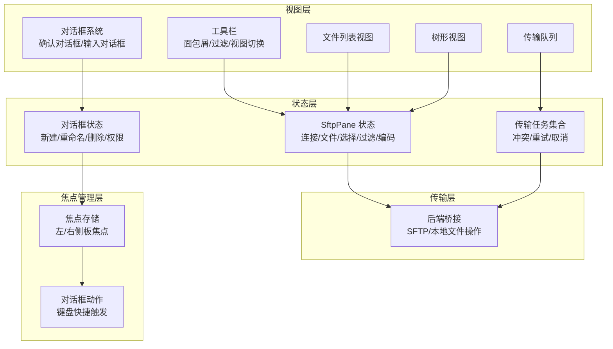

**图表来源**
- [SftpPaneView.tsx:82-671](file://components/sftp/SftpPaneView.tsx#L82-L671)
- [SftpPaneToolbar.tsx:66-687](file://components/sftp/SftpPaneToolbar.tsx#L66-L687)
- [SftpPaneFileList.tsx:120-704](file://components/sftp/SftpPaneFileList.tsx#L120-L704)
- [SftpPaneTreeView.tsx:26-988](file://components/sftp/SftpPaneTreeView.tsx#L26-L988)
- [types.ts:1-74](file://application/state/sftp/types.ts#L1-L74)
- [useSftpTransfers.ts:19-990](file://application/state/sftp/useSftpTransfers.ts#L19-L990)
- [SftpPaneDialogs.tsx:113-119](file://components/sftp/SftpPaneDialogs.tsx#L113-L119)
- [useSftpDialogAction.ts:30-68](file://components/sftp/hooks/useSftpDialogAction.ts#L30-L68)
- [useSftpFocusedPane.ts:21-43](file://components/sftp/hooks/useSftpFocusedPane.ts#L21-L43)

**章节来源**
- [SftpPaneView.tsx:82-671](file://components/sftp/SftpPaneView.tsx#L82-L671)
- [types.ts:1-74](file://application/state/sftp/types.ts#L1-L74)

## 核心组件
- 双面板视图容器：负责左右面板的可见性、激活态、懒加载树视图、路径同步与刷新。
- 工具栏：面包屑导航、过滤条、视图模式切换、新建文件/文件夹、隐藏文件显示、编码设置、刷新等。
- 文件列表视图：网格列头（名称/修改时间/大小/类型）、行渲染、上下文菜单、拖拽/放置、虚拟化滚动。
- 树形视图：按需加载子节点、展开/折叠、键盘导航、拖放移动、右键菜单、路径高亮。
- 传输队列：多级任务展示、父子任务联动、列宽可调、拖拽调整高度、暂停/恢复/取消/重试。
- 文件操作钩子：打开/编辑/下载/上传、文件关联（内置编辑器/系统应用）、权限修改。
- 状态管理：SftpPane 状态、文件操作动作、传输任务生命周期。
- 对话框系统：确认对话框（删除/覆盖）、输入对话框（新建/重命名/移动到）、权限对话框。
- 焦点管理：自动焦点定位、键盘快捷键响应、无障碍访问支持。

**章节来源**
- [SftpPaneView.tsx:82-671](file://components/sftp/SftpPaneView.tsx#L82-L671)
- [SftpPaneToolbar.tsx:66-687](file://components/sftp/SftpPaneToolbar.tsx#L66-L687)
- [SftpPaneFileList.tsx:120-704](file://components/sftp/SftpPaneFileList.tsx#L120-L704)
- [SftpPaneTreeView.tsx:26-988](file://components/sftp/SftpPaneTreeView.tsx#L26-L988)
- [SftpTransferQueue.tsx:150-456](file://components/sftp/SftpTransferQueue.tsx#L150-L456)
- [useSftpViewFileOps.ts:13-900](file://components/sftp/hooks/useSftpViewFileOps.ts#L13-L900)
- [types.ts:1-74](file://application/state/sftp/types.ts#L1-L74)
- [SftpPaneDialogs.tsx:113-119](file://components/sftp/SftpPaneDialogs.tsx#L113-L119)

## 架构总览
SFTP 双面板通过 Context 提供稳定的回调引用，避免因回调变更导致的重复渲染；文件操作通过状态层统一调度，传输层负责具体 IO 并与后端桥接通信。新增的焦点管理系统确保对话框的键盘无障碍体验，通过自动焦点定位提升用户体验。

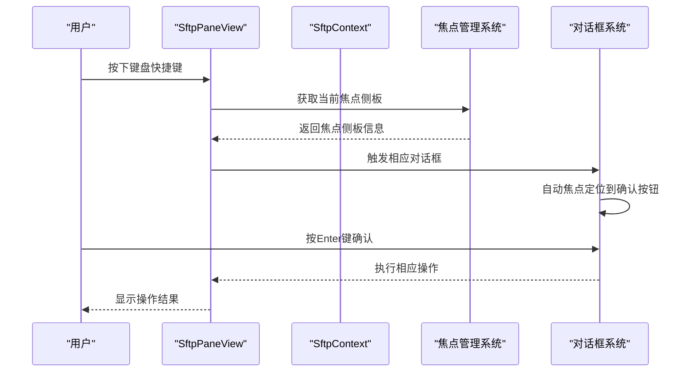

**图表来源**
- [SftpPaneView.tsx:606-647](file://components/sftp/SftpPaneView.tsx#L606-L647)
- [useSftpDialogAction.ts:85-124](file://components/sftp/hooks/useSftpDialogAction.ts#L85-L124)
- [useSftpFocusedPane.ts:48-54](file://components/sftp/hooks/useSftpFocusedPane.ts#L48-L54)
- [SftpPaneDialogs.tsx:235-238](file://components/sftp/SftpPaneDialogs.tsx#L235-L238)
- [SftpPaneDialogs.tsx:306-309](file://components/sftp/SftpPaneDialogs.tsx#L306-L309)

## 详细组件分析

### 双面板文件浏览器
- 面板容器与懒加载：仅在激活或需要时渲染树视图，减少内存占用。
- 视图模式：支持"列表/树"两种模式，切换时清空另一模式的排序/选择状态。
- 面包屑导航：双击进入路径编辑，支持历史与文件夹建议，快速跳转。
- 过滤条：输入关键字即时筛选文件名，Esc 关闭。
- 加载/错误/重连遮罩：导航期间保持旧内容，避免空白闪烁；断开重连时显示旋转指示。

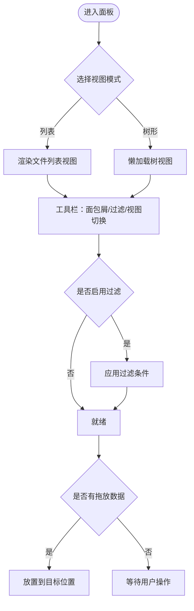

**图表来源**
- [SftpPaneView.tsx:82-671](file://components/sftp/SftpPaneView.tsx#L82-L671)
- [SftpPaneToolbar.tsx:66-687](file://components/sftp/SftpPaneToolbar.tsx#L66-L687)
- [SftpPaneFileList.tsx:120-704](file://components/sftp/SftpPaneFileList.tsx#L120-L704)
- [SftpPaneTreeView.tsx:26-988](file://components/sftp/SftpPaneTreeView.tsx#L26-L988)

**章节来源**
- [SftpPaneView.tsx:82-671](file://components/sftp/SftpPaneView.tsx#L82-L671)
- [SftpPaneToolbar.tsx:66-687](file://components/sftp/SftpPaneToolbar.tsx#L66-L687)

### 文件列表视图与树形视图
- 文件列表视图
  - 表头：名称/修改时间/大小/类型，支持点击排序与列宽拖拽。
  - 行渲染：选中高亮、拖拽悬停高亮、双击打开、右键菜单。
  - 上下文菜单：打开/打开到/打开方式、编辑、下载、复制到另一面板、剪切路径、移动到上级、重命名、权限、删除、刷新、新建文件/文件夹、上传文件/文件夹。
  - 虚拟化：大列表自动虚拟化，提升滚动性能。
- 树形视图
  - 按需加载子节点，支持展开/折叠、键盘方向键导航、Shift 多选、Enter 打开。
  - 拖放：同面板内移动、跨面板复制/移动、从外部拖入上传。
  - 右键菜单：重命名、删除、新建、上传、移动到目标路径等。

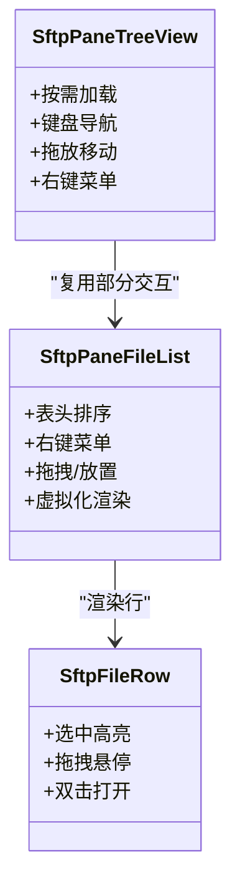

**图表来源**
- [SftpPaneFileList.tsx:120-704](file://components/sftp/SftpPaneFileList.tsx#L120-L704)
- [SftpPaneTreeView.tsx:26-988](file://components/sftp/SftpPaneTreeView.tsx#L26-L988)
- [SftpFileRow.tsx:12-165](file://components/sftp/SftpFileRow.tsx#L12-L165)

**章节来源**
- [SftpPaneFileList.tsx:120-704](file://components/sftp/SftpPaneFileList.tsx#L120-L704)
- [SftpPaneTreeView.tsx:26-988](file://components/sftp/SftpPaneTreeView.tsx#L26-L988)
- [SftpFileRow.tsx:12-165](file://components/sftp/SftpFileRow.tsx#L12-L165)

### 文件操作（复制/移动/删除/重命名/权限）
- 复制到另一面板：从源面板选择文件，右键"复制到另一面板"，目标面板自动接收并显示在当前目录。
- 移动/剪切：同面板内拖放至目录，或右键"移动到上级/移动到目标路径"；跨面板拖放默认复制。
- 删除：右键"删除"，弹出确认对话框；支持批量删除。
- 重命名：右键"重命名"或双击文件名，输入新名称。
- 权限修改：右键"权限"，弹出权限对话框进行修改（仅远程文件）。

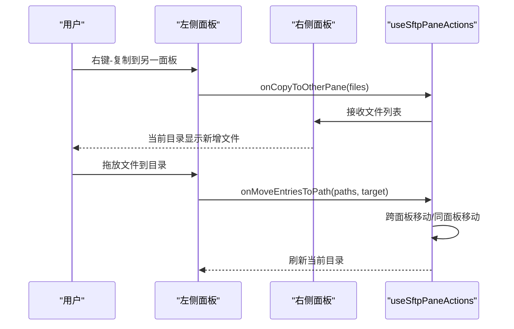

**图表来源**
- [useSftpPaneActions.ts:508-744](file://application/state/sftp/useSftpPaneActions.ts#L508-L744)
- [SftpPaneFileList.tsx:320-427](file://components/sftp/SftpPaneFileList.tsx#L320-L427)
- [SftpPaneTreeView.tsx:641-656](file://components/sftp/SftpPaneTreeView.tsx#L641-L656)

**章节来源**
- [useSftpPaneActions.ts:508-744](file://application/state/sftp/useSftpPaneActions.ts#L508-L744)
- [SftpPaneFileList.tsx:320-427](file://components/sftp/SftpPaneFileList.tsx#L320-L427)
- [SftpPaneTreeView.tsx:641-656](file://components/sftp/SftpPaneTreeView.tsx#L641-L656)

### 拖放上传/下载
- 拖放上传
  - 列表视图：在空白区域或目录上拖入文件/文件夹，自动上传到目标路径。
  - 树形视图：在节点上拖放，支持复制/移动/上传三种效果（根据来源与目标判断）。
- 拖放下载
  - 列表/树视图：右键"下载"，或直接拖拽文件到本地文件系统（若后端支持流式下载）。
- 批量传输
  - 选中多个文件后统一下载，避免多次弹窗；上传时支持 FileList 或 DataTransfer。

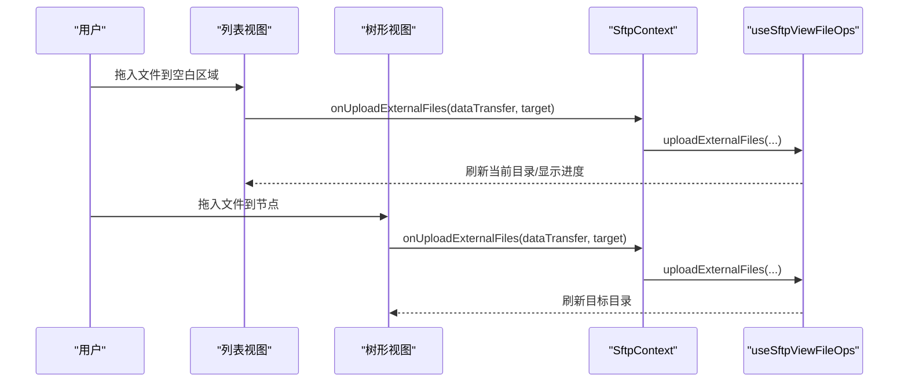

**图表来源**
- [SftpPaneFileList.tsx:609-618](file://components/sftp/SftpPaneFileList.tsx#L609-L618)
- [SftpPaneTreeView.tsx:731-781](file://components/sftp/SftpPaneTreeView.tsx#L731-L781)
- [useSftpViewFileOps.ts:272-425](file://components/sftp/hooks/useSftpViewFileOps.ts#L272-L425)

**章节来源**
- [SftpPaneFileList.tsx:609-618](file://components/sftp/SftpPaneFileList.tsx#L609-L618)
- [SftpPaneTreeView.tsx:731-781](file://components/sftp/SftpPaneTreeView.tsx#L731-L781)
- [useSftpViewFileOps.ts:272-425](file://components/sftp/hooks/useSftpViewFileOps.ts#L272-L425)

### 文件关联与内置编辑器
- 文件关联
  - 支持"内置编辑器"或"系统应用"两种打开方式；可保存扩展名默认打开器。
  - 右键"打开方式"可弹出选择器，支持选择系统应用并设为默认。
- 内置编辑器
  - 文本文件直接在内置编辑器中打开，支持语言识别、自动同步（可选）。
  - 编辑完成后保存，系统会校验当前连接是否仍指向同一主机，防止写错目标。

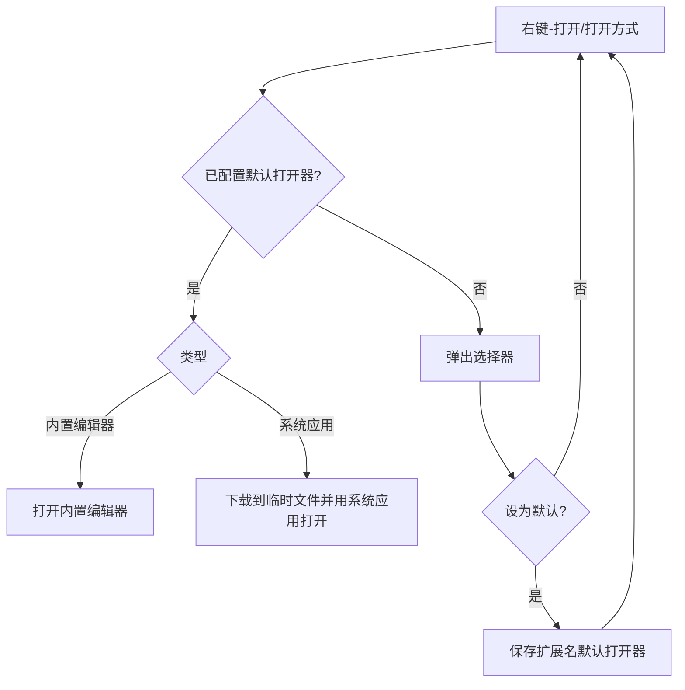

**图表来源**
- [useSftpViewFileOps.ts:107-172](file://components/sftp/hooks/useSftpViewFileOps.ts#L107-L172)
- [SftpPaneFileList.tsx:287-321](file://components/sftp/SftpPaneFileList.tsx#L287-L321)

**章节来源**
- [useSftpViewFileOps.ts:107-172](file://components/sftp/hooks/useSftpViewFileOps.ts#L107-L172)
- [SftpPaneFileList.tsx:287-321](file://components/sftp/SftpPaneFileList.tsx#L287-L321)

### 传输队列管理
- 展示与交互
  - 支持父任务展开查看子任务；列宽可调；拖拽调整面板高度。
  - 支持暂停/恢复、取消、重试；完成/取消任务可一键清理。
- 错误处理与重试
  - 单文件失败不阻塞整目录；部分失败时禁用自动重试以避免重复覆盖。
  - 支持批量冲突处理（替换/跳过/去重/停止）。
- 进度监控
  - 实时更新已传输字节、总大小、速度；支持外部下载任务注入队列。

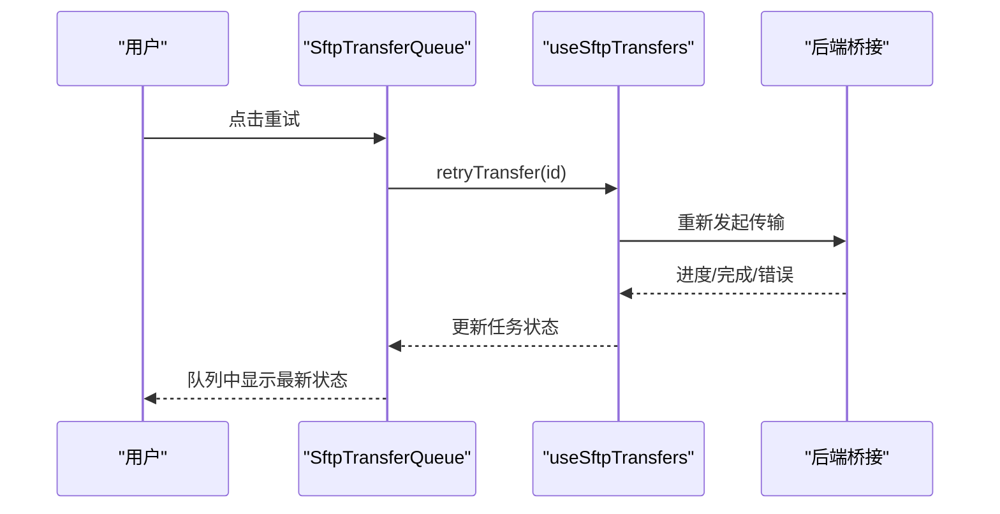

**图表来源**
- [SftpTransferQueue.tsx:150-456](file://components/sftp/SftpTransferQueue.tsx#L150-L456)
- [useSftpTransfers.ts:631-668](file://application/state/sftp/useSftpTransfers.ts#L631-L668)

**章节来源**
- [SftpTransferQueue.tsx:150-456](file://components/sftp/SftpTransferQueue.tsx#L150-L456)
- [useSftpTransfers.ts:631-668](file://application/state/sftp/useSftpTransfers.ts#L631-L668)

## 自动焦点管理系统

### 焦点存储机制
系统通过独立的焦点存储模块跟踪当前获得焦点的 SFTP 侧板（左侧或右侧）。当用户在面板间切换时，焦点存储会自动更新，确保后续操作能够正确路由到目标面板。

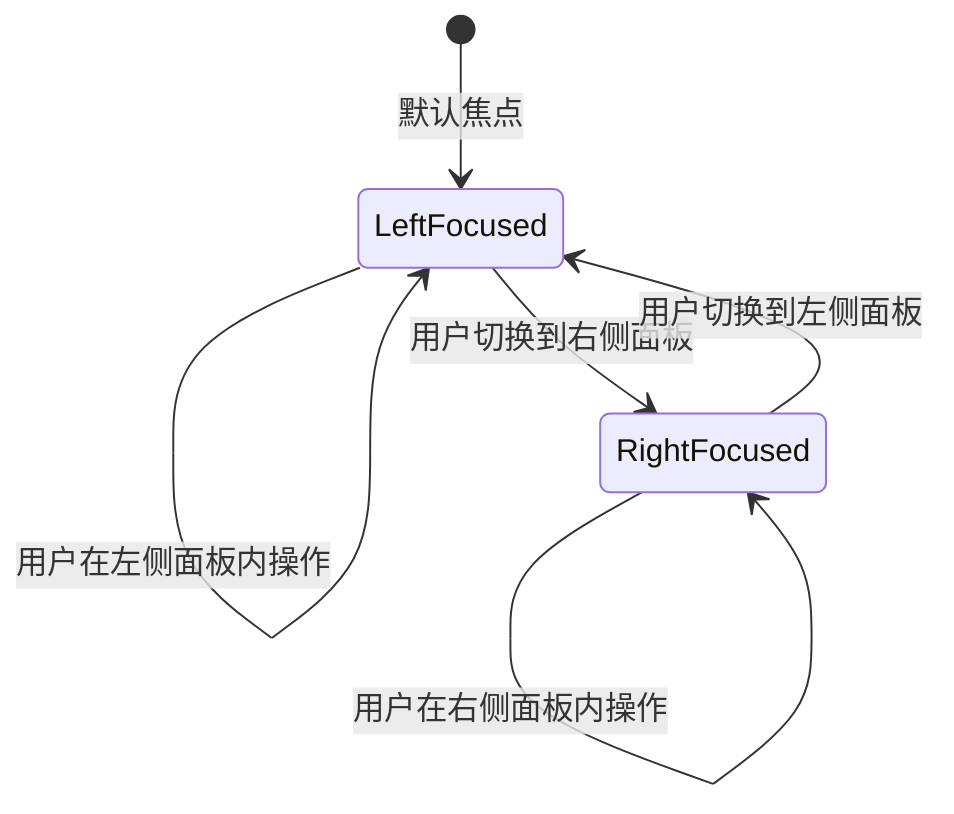

**图表来源**
- [useSftpFocusedPane.ts:21-43](file://components/sftp/hooks/useSftpFocusedPane.ts#L21-L43)

### 对话框自动焦点定位
确认对话框（删除/覆盖）实现了智能的自动焦点定位功能。当对话框打开时，系统会阻止默认的自动聚焦行为，并将焦点精确地定位到确认按钮上，使用户能够直接按 Enter 键确认操作。

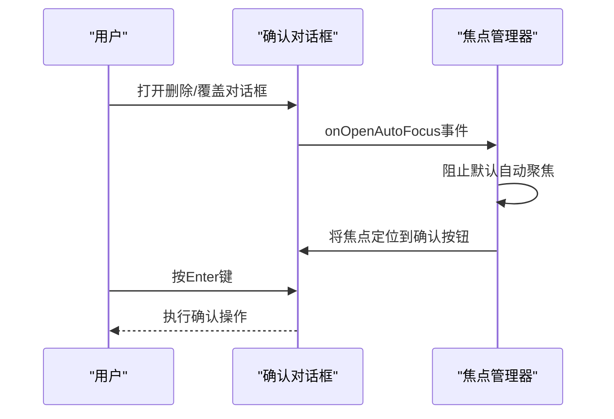

**图表来源**
- [SftpPaneDialogs.tsx:235-238](file://components/sftp/SftpPaneDialogs.tsx#L235-L238)
- [SftpPaneDialogs.tsx:306-309](file://components/sftp/SftpPaneDialogs.tsx#L306-L309)

### 键盘快捷键支持
系统支持通过键盘快捷键触发各种对话框操作，包括新建文件/文件夹、重命名、删除等。这些操作通过焦点存储确定应该在哪个面板执行，确保操作的准确性。

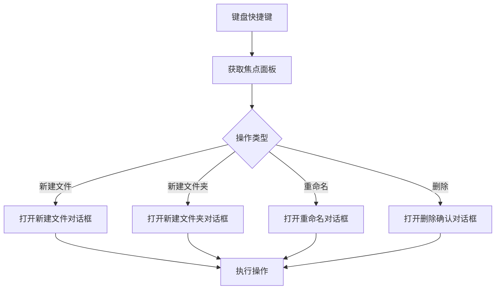

**图表来源**
- [useSftpDialogAction.ts:85-124](file://components/sftp/hooks/useSftpDialogAction.ts#L85-L124)
- [useSftpFocusedPane.ts:48-54](file://components/sftp/hooks/useSftpFocusedPane.ts#L48-L54)

### 无障碍访问增强
自动焦点管理系统显著改善了键盘无障碍体验：

- **Enter 键确认**：确认对话框自动将焦点定位到确认按钮，用户可以直接按 Enter 键确认操作，无需手动导航。
- **焦点保持**：对话框关闭时，焦点会返回到触发操作的元素，保持操作流程的连续性。
- **键盘导航**：所有对话框都支持 Tab 键在不同控件间导航，提供完整的键盘操作体验。
- **屏幕阅读器支持**：对话框具有适当的 ARIA 标签和语义，支持屏幕阅读器正确读取。

**章节来源**
- [SftpPaneDialogs.tsx:113-119](file://components/sftp/SftpPaneDialogs.tsx#L113-L119)
- [SftpPaneDialogs.tsx:235-238](file://components/sftp/SftpPaneDialogs.tsx#L235-L238)
- [SftpPaneDialogs.tsx:306-309](file://components/sftp/SftpPaneDialogs.tsx#L306-L309)
- [useSftpDialogAction.ts:30-68](file://components/sftp/hooks/useSftpDialogAction.ts#L30-L68)
- [useSftpFocusedPane.ts:21-43](file://components/sftp/hooks/useSftpFocusedPane.ts#L21-L43)

## 依赖关系分析
- 组件耦合
  - SftpPaneView 作为根容器，聚合工具栏、列表/树视图、对话框与传输队列。
  - SftpContext 提供稳定回调，降低 props 钻取与重渲染。
  - useSftpPaneActions 与 useSftpTransfers 分别封装文件操作与传输逻辑，职责清晰。
  - 焦点管理系统独立运行，为对话框提供无障碍支持。
- 外部依赖
  - 后端桥接负责实际的 SFTP/本地文件读写、统计、权限修改、流式下载等。
  - 国际化与主题库提供文案与样式支持。

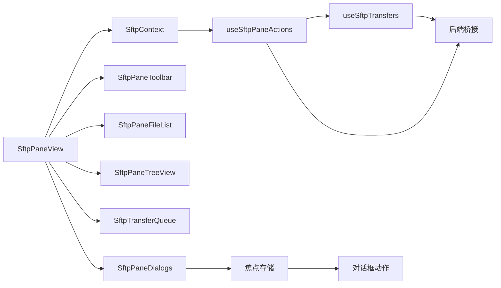

**图表来源**
- [SftpPaneView.tsx:82-671](file://components/sftp/SftpPaneView.tsx#L82-L671)
- [SftpContext.tsx:125-223](file://components/sftp/SftpContext.tsx#L125-L223)
- [useSftpPaneActions.ts:63-965](file://application/state/sftp/useSftpPaneActions.ts#L63-L965)
- [useSftpTransfers.ts:19-990](file://application/state/sftp/useSftpTransfers.ts#L19-L990)
- [SftpPaneDialogs.tsx:113-119](file://components/sftp/SftpPaneDialogs.tsx#L113-L119)
- [useSftpDialogAction.ts:30-68](file://components/sftp/hooks/useSftpDialogAction.ts#L30-L68)
- [useSftpFocusedPane.ts:21-43](file://components/sftp/hooks/useSftpFocusedPane.ts#L21-L43)

**章节来源**
- [SftpPaneView.tsx:82-671](file://components/sftp/SftpPaneView.tsx#L82-L671)
- [SftpContext.tsx:125-223](file://components/sftp/SftpContext.tsx#L125-L223)

## 性能考量
- 虚拟化滚动：大列表自动启用虚拟化，减少 DOM 节点数量，提升滚动流畅度。
- 懒加载树视图：首次进入树视图才渲染，避免不必要的初始化成本。
- 列宽与排序缓存：列宽持久化、排序状态与列表顺序缓存，减少重复计算。
- 导航缓存：目录列表缓存与"最后确认状态"机制，避免竞态与回退闪烁。
- 传输并发：目录传输采用分批/异步策略，单文件失败不影响整体进度。
- 焦点管理优化：焦点存储使用订阅模式，只在焦点变化时通知相关组件，减少不必要的重渲染。

[本节为通用指导，无需特定文件引用]

## 故障排查指南
- 连接丢失/重连
  - 现象：面板显示"正在重连"或错误提示。
  - 处理：点击刷新按钮触发重连；若后台标签页无焦点，重连会在切换回该标签页时自动触发。
- 传输中断/失败
  - 现象：传输队列中出现失败项，或提示"传输取消/失败"。
  - 处理：在队列中重试；若为部分失败，系统会禁用自动重试以避免覆盖已成功文件。
- 文件权限问题
  - 现象：修改权限失败或权限未生效。
  - 处理：确保当前连接具备相应权限；仅远程文件支持权限修改。
- 拖放无效
  - 现象：拖放后无反应。
  - 处理：确认目标为目录且非".."；检查是否跨面板拖放（默认复制）；确保后端桥接支持对应操作。
- 对话框焦点问题
  - 现象：对话框打开后无法通过键盘操作。
  - 处理：检查浏览器的键盘无障碍设置；确认焦点存储正常工作；尝试重新聚焦面板。

**章节来源**
- [SftpPaneFileList.tsx:80-118](file://components/sftp/SftpPaneFileList.tsx#L80-L118)
- [useSftpTransfers.ts:460-506](file://application/state/sftp/useSftpTransfers.ts#L460-L506)

## 结论
SFTP 双面板文件浏览器提供了直观、高效的文件管理体验：列表/树双视图满足不同场景需求；完善的文件操作与拖放上传/下载简化了日常任务；传输队列与冲突处理保障了批量任务的可控性；文件关联与内置编辑器提升了文本文件的编辑效率。新增的自动焦点管理系统显著改善了键盘无障碍体验，通过智能的对话框焦点定位和键盘快捷键支持，确保用户能够高效地完成各种操作。结合本文的安全性与性能建议，可在复杂网络环境下稳定高效地完成文件传输工作。

[本节为总结，无需特定文件引用]

## 附录
- 快捷操作速查
  - 新建：工具栏"新建文件夹/新建文件"或键盘快捷键
  - 刷新：工具栏"刷新"或快捷键
  - 过滤：工具栏"搜索"开启过滤条
  - 视图：工具栏"列表/树"切换
  - 隐藏文件：工具栏"显示/隐藏文件"
  - 编码：远程文件可切换"自动/UTF-8/GB18030"
  - 对话框：Enter 键确认，Esc 键取消
- 安全建议
  - 使用内置编辑器保存时，系统会校验连接主机一致性，避免写入错误目标。
  - 对于敏感文件，优先使用加密通道与强口令认证。
  - 定期清理传输队列中的已完成/取消任务，释放内存。
  - 删除操作前请确认目标文件，避免误删重要文件。
- 性能优化
  - 大目录优先使用树视图，按需展开子节点。
  - 批量下载时选择单一目标目录，减少弹窗与 IO 开销。
  - 合理设置列宽与排序，避免频繁重排。
  - 利用键盘快捷键提高操作效率，减少鼠标操作。
- 无障碍功能
  - 支持完整的键盘导航和快捷键操作
  - 对话框自动焦点定位，Enter 键直接确认
  - 屏幕阅读器友好，具有适当的语义标记
  - 焦点状态持续跟踪，确保操作的准确性

[本节为补充说明，无需特定文件引用]