# 主机管理

<cite>
**本文引用的文件**
- [HostTreeView.tsx](file://components/HostTreeView.tsx)
- [useVaultHostCollections.tsx](file://components/vault/useVaultHostCollections.tsx)
- [HostDetailsPanel.tsx](file://components/HostDetailsPanel.tsx)
- [HostNotesEditor.tsx](file://components/host/HostNotesEditor.tsx)
- [HostNotesIndicator.tsx](file://components/host/HostNotesIndicator.tsx)
- [VaultHostListSection.tsx](file://components/vault/VaultHostListSection.tsx)
- [HostDetailsAdvancedSections.tsx](file://components/HostDetailsAdvancedSections.tsx)
- [groupConfig.ts](file://domain/groupConfig.ts)
- [host.ts](file://domain/host.ts)
- [VaultView.tsx](file://components/VaultView.tsx)
- [storageKeys.ts](file://infrastructure/config/storageKeys.ts)
- [VaultView.sortPersistence.test.tsx](file://components/VaultView.sortPersistence.test.tsx)
- [HostDetailsPanel.helpers.ts](file://components/HostDetailsPanel.helpers.ts)
- [knownHosts.ts](file://domain/knownHosts.ts)
- [KnownHostsManager.tsx](file://components/KnownHostsManager.tsx)
- [vaultBackupBridge.cjs](file://electron/bridges/vaultBackupBridge.cjs)
- [vaultBackupBridge.test.cjs](file://electron/bridges/vaultBackupBridge.test.cjs)
- [vault.ts](file://application/i18n/locales/zh-CN/vault.ts)
- [vault.ts](file://application/i18n/locales/en/vault.ts)
</cite>

## 更新摘要
**所做的更改**
- 新增主机注释系统集成，包括注释编辑器和注释指示器组件
- 改进主机详情面板，新增注释功能区域
- 更新主机列表视图，集成注释指示器显示
- 增强主机管理的元数据管理能力

## 目录
1. [简介](#简介)
2. [项目结构](#项目结构)
3. [核心组件](#核心组件)
4. [架构总览](#架构总览)
5. [详细组件分析](#详细组件分析)
6. [依赖关系分析](#依赖关系分析)
7. [性能考量](#性能考量)
8. [故障排查指南](#故障排查指南)
9. [结论](#结论)
10. [附录](#附录)

## 简介
本章节面向"SSH主机管理"功能，系统性阐述如何在保管库中添加、编辑、删除与组织 SSH 主机连接；详解主机基本配置项（主机名、IP 地址、端口、用户名等）；说明标签与分组体系（创建分组、移动主机、按标签分类）；介绍列表视图（网格/列表/树）与排序（按名称、最近连接时间等）、搜索能力；并提供复制凭据、批量选择、导入导出等高级能力的使用指南。

**更新** 新增主机注释系统，支持在主机详情中添加和管理注释，注释内容支持 Markdown 格式，可作为主机的元数据进行管理。

## 项目结构
围绕主机管理的关键模块分布如下：
- 视图层：主机树形视图、主机详情面板、保管库视图、注释编辑器、注释指示器
- 域模型与逻辑：主机模型、分组默认值合并、主机规范化与协议解析
- 状态与集合：保管库主机集合计算、过滤、排序、分组树构建
- 集成与持久化：本地存储键、备份桥接、已知主机管理

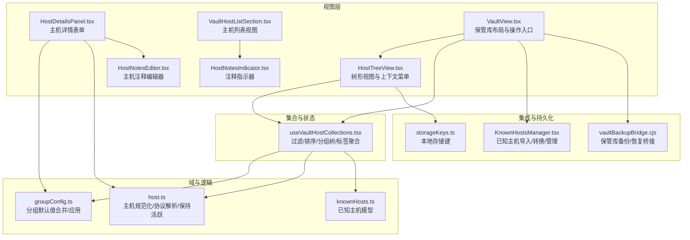

**图表来源**
- [HostTreeView.tsx:448-634](file://components/HostTreeView.tsx#L448-L634)
- [HostDetailsPanel.tsx:770-775](file://components/HostDetailsPanel.tsx#L770-L775)
- [VaultHostListSection.tsx:159](file://components/vault/VaultHostListSection.tsx#L159)
- [HostNotesEditor.tsx:1-84](file://components/host/HostNotesEditor.tsx#L1-L84)
- [HostNotesIndicator.tsx:1-40](file://components/host/HostNotesIndicator.tsx#L1-L40)
- [useVaultHostCollections.tsx:24-496](file://components/vault/useVaultHostCollections.tsx#L24-L496)
- [groupConfig.ts:30-140](file://domain/groupConfig.ts#L30-L140)
- [host.ts:205-265](file://domain/host.ts#L205-L265)
- [VaultView.tsx:779-836](file://components/VaultView.tsx#L779-L836)
- [storageKeys.ts](file://infrastructure/config/storageKeys.ts)
- [KnownHostsManager.tsx:44-82](file://components/KnownHostsManager.tsx#L44-L82)
- [vaultBackupBridge.cjs:74-115](file://electron/bridges/vaultBackupBridge.cjs#L74-L115)

**章节来源**
- [HostTreeView.tsx:1-634](file://components/HostTreeView.tsx#L1-L634)
- [useVaultHostCollections.tsx:1-496](file://components/vault/useVaultHostCollections.tsx#L1-L496)
- [HostDetailsPanel.tsx:1-964](file://components/HostDetailsPanel.tsx#L1-L964)
- [HostNotesEditor.tsx:1-84](file://components/host/HostNotesEditor.tsx#L1-L84)
- [HostNotesIndicator.tsx:1-40](file://components/host/HostNotesIndicator.tsx#L1-L40)
- [VaultHostListSection.tsx:1-821](file://components/vault/VaultHostListSection.tsx#L1-L821)
- [groupConfig.ts:1-140](file://domain/groupConfig.ts#L1-L140)
- [host.ts:1-265](file://domain/host.ts#L1-L265)
- [VaultView.tsx:779-836](file://components/VaultView.tsx#L779-L836)
- [storageKeys.ts](file://infrastructure/config/storageKeys.ts)
- [KnownHostsManager.tsx:44-82](file://components/KnownHostsManager.tsx#L44-L82)
- [vaultBackupBridge.cjs:74-115](file://electron/bridges/vaultBackupBridge.cjs#L74-L115)

## 核心组件
- 主机树形视图（HostTreeView）
  - 支持展开/折叠、右键上下文菜单、拖拽移动主机与分组、多选、按多种方式排序、显示协议与标签徽标、复制凭据等。
- 保管库主机集合（useVaultHostCollections）
  - 负责构建分组树、过滤（搜索/标签/分组）、排序（名称、新建时间、最旧、按分组）、聚合标签、计算根级置顶/最近连接展示。
- 主机详情面板（HostDetailsPanel）
  - 提供通用信息（标签、分组、标签输入、注释编辑）、连接信息（协议、主机名/IP、端口、用户名、字符集）、认证方式（密码/密钥/代理转发）、代理配置、主题与字体覆盖、链式跳转等。
- 注释编辑器（HostNotesEditor）
  - 提供 Markdown 格式的注释编辑功能，支持编辑和预览两个标签页，实时预览注释内容。
- 注释指示器（HostNotesIndicator）
  - 在主机列表中显示注释徽章，鼠标悬停显示注释预览内容。
- 分组默认值（groupConfig）
  - 将父级分组配置逐级合并到子分组，支持仅继承部分字段、代理配置与主题/字体覆盖策略。
- 主机域逻辑（host）
  - 主机规范化、Telnet 默认值解析、SSH 保活策略解析、显示格式化（主机:端口）、设备类型识别与会话探测门控等。
- 已知主机管理（KnownHostsManager）
  - 解析 known_hosts 文件、导入/更新/删除/转换为保管库主机、刷新扫描等。

**章节来源**
- [HostTreeView.tsx:15-634](file://components/HostTreeView.tsx#L15-L634)
- [useVaultHostCollections.tsx:24-496](file://components/vault/useVaultHostCollections.tsx#L24-L496)
- [HostDetailsPanel.tsx:61-800](file://components/HostDetailsPanel.tsx#L61-L800)
- [HostNotesEditor.tsx:17-23](file://components/host/HostNotesEditor.tsx#L17-L23)
- [HostNotesIndicator.tsx:13-16](file://components/host/HostNotesIndicator.tsx#L13-L16)
- [groupConfig.ts:14-140](file://domain/groupConfig.ts#L14-L140)
- [host.ts:14-265](file://domain/host.ts#L14-L265)
- [KnownHostsManager.tsx:44-82](file://components/KnownHostsManager.tsx#L44-L82)

## 架构总览
主机管理从"视图层"接收用户交互，通过"集合与状态"完成筛选/排序/分组树构建，再结合"域与逻辑"中的分组默认值与主机规范化，最终驱动"集成与持久化"完成保存、导入导出与本地存储。

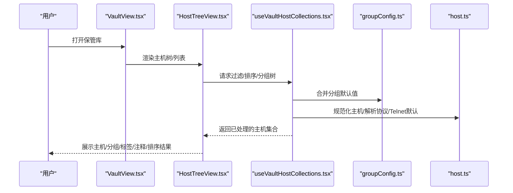

**图表来源**
- [VaultView.tsx:779-836](file://components/VaultView.tsx#L779-L836)
- [HostTreeView.tsx:448-634](file://components/HostTreeView.tsx#L448-L634)
- [useVaultHostCollections.tsx:118-295](file://components/vault/useVaultHostCollections.tsx#L118-L295)
- [groupConfig.ts:30-140](file://domain/groupConfig.ts#L30-L140)
- [host.ts:205-265](file://domain/host.ts#L205-L265)

## 详细组件分析

### 组件A：主机树形视图（HostTreeView）
- 功能要点
  - 支持分组展开/折叠、右键菜单（新建主机/分组、重命名、删除、取消托管）。
  - 拖拽：主机拖拽到分组内移动；分组拖拽到目标路径移动；支持拖拽悬停高亮。
  - 多选：点击主机条目进入多选模式，勾选后可批量操作。
  - 排序：支持按名称升/降、按创建时间新/旧、按分组排序。
  - 显示：协议徽标、标签预览、用户名@主机:端口、分组计数、注释指示器。
  - 连接/编辑/复制凭据/删除/克隆等操作入口。
- 关键流程（拖拽移动主机）
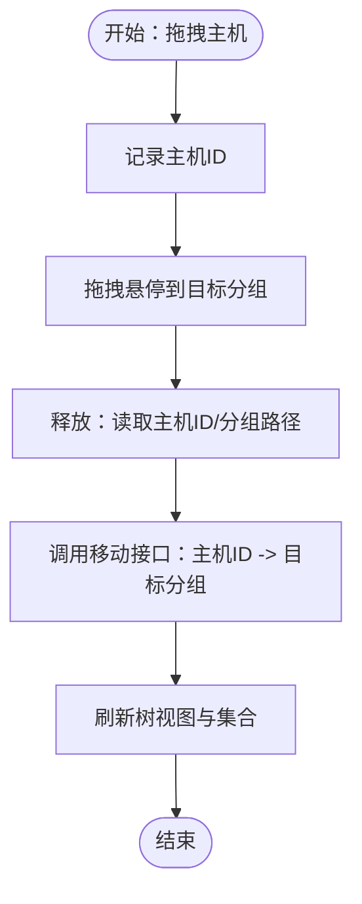

**图表来源**
- [HostTreeView.tsx:156-178](file://components/HostTreeView.tsx#L156-L178)

**章节来源**
- [HostTreeView.tsx:15-634](file://components/HostTreeView.tsx#L15-L634)

### 组件B：保管库主机集合（useVaultHostCollections）
- 功能要点
  - 构建分组树：根据自定义分组与主机分组路径生成树结构，并统计每个节点的主机总数。
  - 过滤：支持全局搜索（标签/主机名/别名/注释）、按标签过滤、按当前分组或仅未分组显示。
  - 排序：名称升/降、创建时间新/旧、按分组排序。
  - 根级展示：置顶主机、最近连接主机（受搜索/标签过滤影响）。
  - 标签聚合：收集所有标签，支持重命名/删除标签并批量更新主机。
  - 树视图专用数据：独立的树视图主机列表，尊重搜索/标签过滤但不按分组过滤。
- 关键流程（搜索与标签过滤）
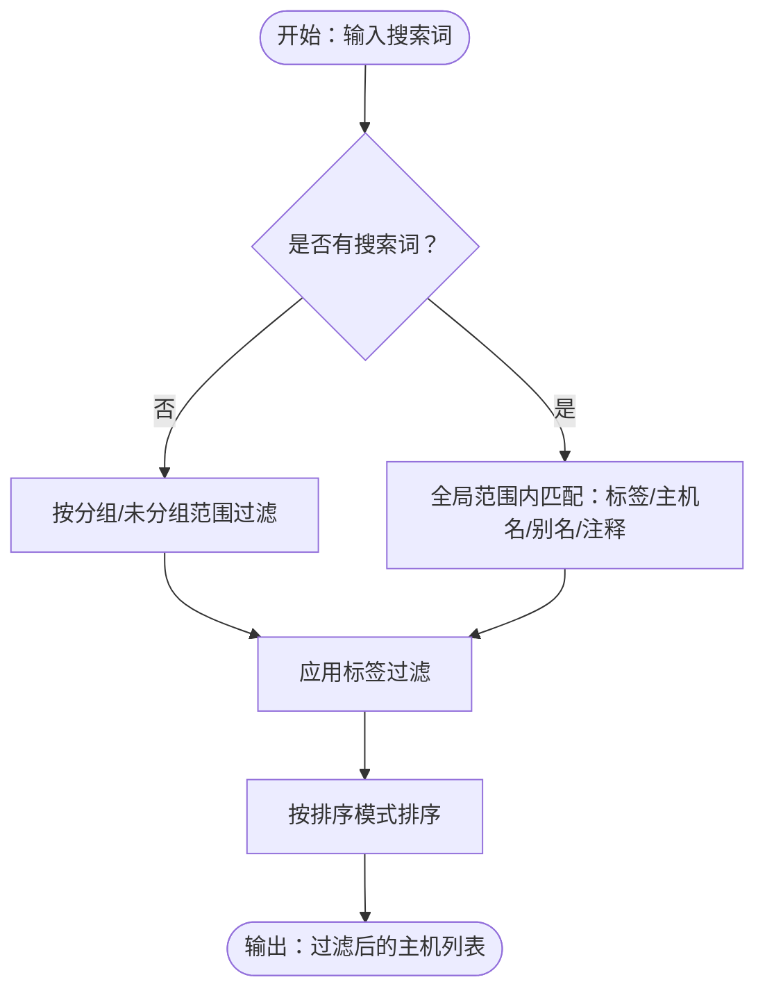

**图表来源**
- [useVaultHostCollections.tsx:118-179](file://components/vault/useVaultHostCollections.tsx#L118-L179)

**章节来源**
- [useVaultHostCollections.tsx:24-496](file://components/vault/useVaultHostCollections.tsx#L24-L496)

### 组件C：主机详情面板（HostDetailsPanel）
- 功能要点
  - 基本信息：别名、分组、标签（支持新建）、注释编辑。
  - 连接信息：协议（SSH/Telnet/MOSH）、主机名/IP、端口、用户名、字符集。
  - 认证方式：密码、密钥（本地文件路径/引用）、代理转发、键盘交互等。
  - 代理配置：内置代理配置或选择代理档案；缺失档案时提示。
  - 高级设置：算法覆盖、环境变量、主题/字体覆盖、链式跳转（多跳主机串联）。
  - 保存：校验必填项与代理配置完整性，清理敏感字段，应用分组默认值与Telnet默认值，回调保存。
- 关键流程（保存主机）
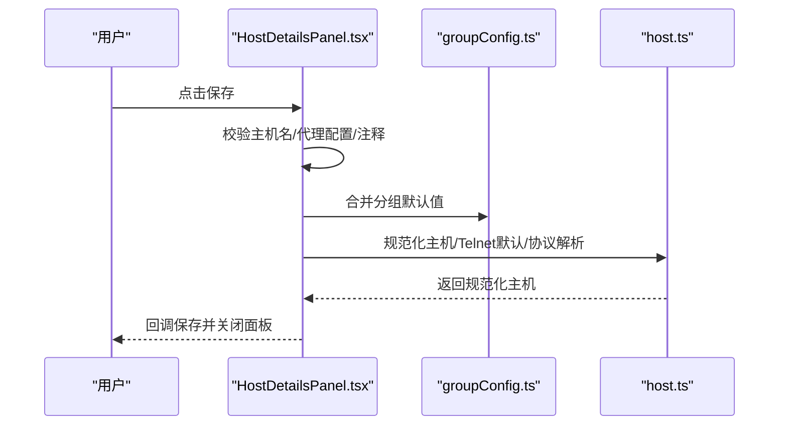

**图表来源**
- [HostDetailsPanel.tsx:343-442](file://components/HostDetailsPanel.tsx#L343-L442)
- [groupConfig.ts:30-140](file://domain/groupConfig.ts#L30-L140)
- [host.ts:205-265](file://domain/host.ts#L205-L265)

**章节来源**
- [HostDetailsPanel.tsx:61-800](file://components/HostDetailsPanel.tsx#L61-L800)
- [HostDetailsPanel.helpers.ts](file://components/HostDetailsPanel.helpers.ts)

### 组件D：注释编辑器（HostNotesEditor）
- 功能要点
  - 支持 Markdown 格式的注释编辑，提供编辑和预览两个标签页。
  - 实时预览注释内容，支持滚动查看长文本。
  - 面板包含标签页切换、占位符提示、空状态处理。
  - 与主机详情面板集成，支持注释内容的双向绑定。
- 关键流程（注释编辑）
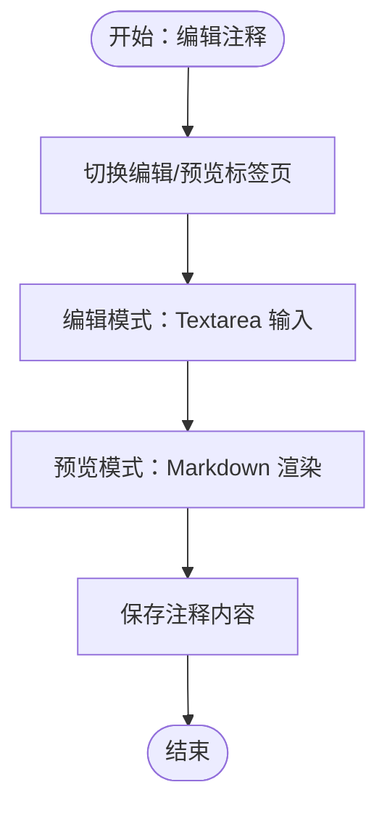

**图表来源**
- [HostNotesEditor.tsx:52-82](file://components/host/HostNotesEditor.tsx#L52-L82)

**章节来源**
- [HostNotesEditor.tsx:1-84](file://components/host/HostNotesEditor.tsx#L1-L84)

### 组件E：注释指示器（HostNotesIndicator）
- 功能要点
  - 在主机列表中显示注释徽章，当主机有注释时显示文件图标。
  - 鼠标悬停显示注释内容预览，支持截断处理。
  - 防止事件冒泡，不影响主机的其他操作。
- 关键流程（注释指示器显示）
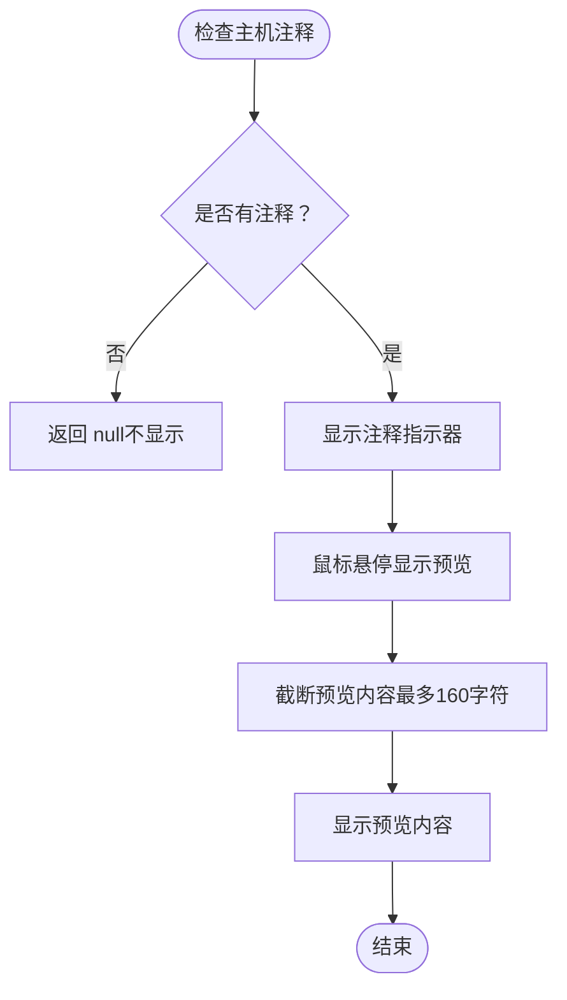

**图表来源**
- [HostNotesIndicator.tsx:22-40](file://components/host/HostNotesIndicator.tsx#L22-L40)

**章节来源**
- [HostNotesIndicator.tsx:1-40](file://components/host/HostNotesIndicator.tsx#L1-L40)

### 组件F：主机列表视图（VaultHostListSection）
- 功能要点
  - 集成注释指示器，在主机列表项右侧显示注释徽章。
  - 支持网格、列表、树三种视图模式。
  - 保持现有主机列表的所有功能：连接、编辑、复制凭据、删除等。
- 关键流程（注释指示器集成）
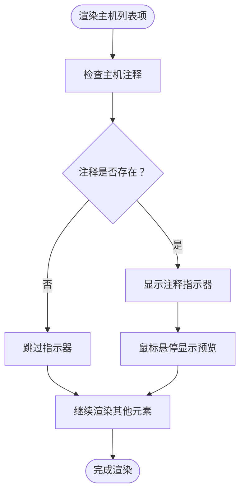

**图表来源**
- [VaultHostListSection.tsx:159](file://components/vault/VaultHostListSection.tsx#L159)

**章节来源**
- [VaultHostListSection.tsx:1-821](file://components/vault/VaultHostListSection.tsx#L1-L821)

### 组件G：分组默认值（groupConfig）
- 功能要点
  - 从子到父逐级合并分组默认值，支持仅继承部分字段（如用户名、端口、代理配置等）。
  - 当主机已有代理配置或可用代理档案时，避免重复继承冲突字段。
  - 支持主题/字体覆盖开关，决定是否应用分组默认值。
- 关键流程（应用分组默认值）
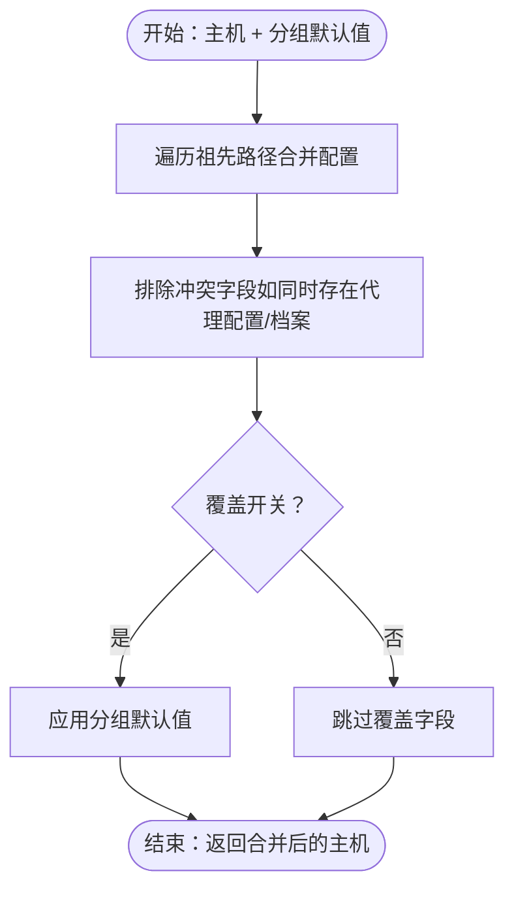

**图表来源**
- [groupConfig.ts:30-140](file://domain/groupConfig.ts#L30-L140)

**章节来源**
- [groupConfig.ts:14-140](file://domain/groupConfig.ts#L14-L140)

### 组件H：主机域逻辑（host）
- 功能要点
  - 主机规范化：清洗主机名、标准化发行版标识、迁移弃用字体覆盖。
  - Telnet 默认值：当协议为 Telnet 时提供默认端口/用户名/密码解析。
  - 保活策略：根据主机覆盖与全局设置决定 SSH 保活间隔与最大重试次数。
  - 显示格式：IPv6 自动加方括号，格式化"主机:端口"。
  - 设备类型识别：基于远端 SSH 版本识别网络设备厂商，控制会话探测与特性启用。
- 关键流程（解析Telnet端口）
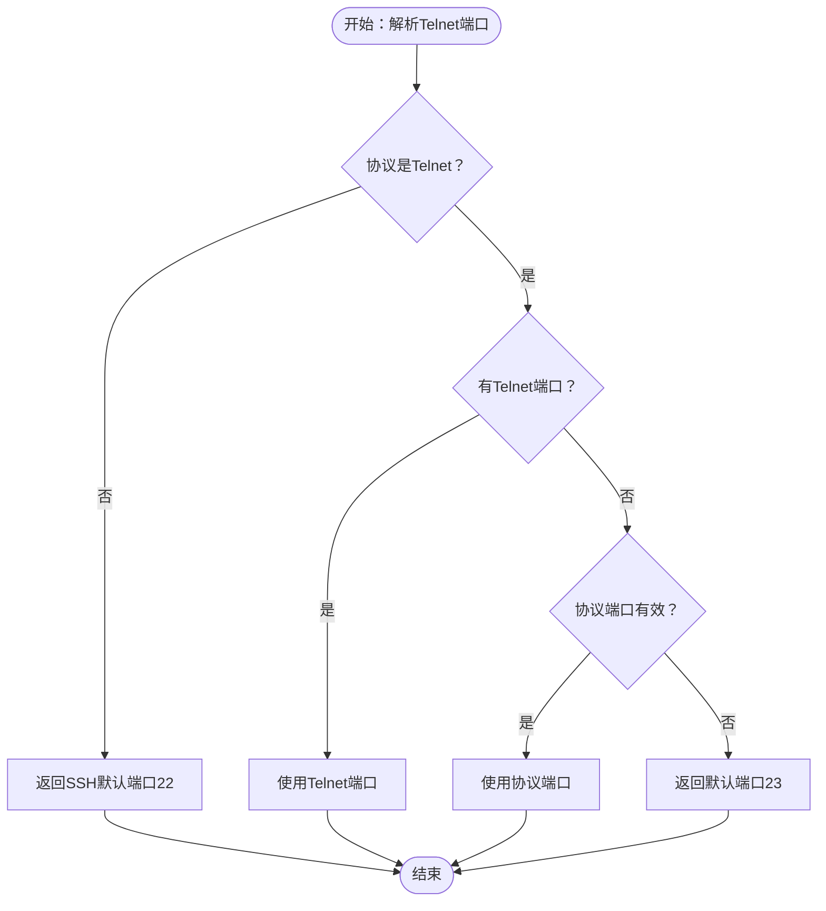

**图表来源**
- [host.ts:190-199](file://domain/host.ts#L190-L199)

**章节来源**
- [host.ts:14-265](file://domain/host.ts#L14-L265)

### 组件I：已知主机管理（KnownHostsManager）
- 功能要点
  - 解析 known_hosts 内容，提取主机模式、密钥类型与公钥指纹。
  - 支持导入、更新、删除、转换为保管库主机、刷新扫描。
  - 对带端口的主机模式进行解析，支持哈希主机名。
- 关键流程（导入known_hosts）
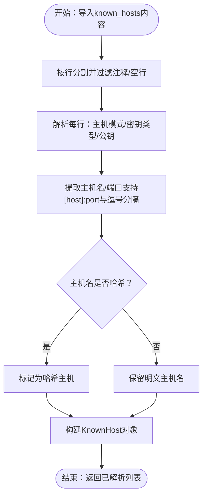

**图表来源**
- [KnownHostsManager.tsx:55-82](file://components/KnownHostsManager.tsx#L55-L82)

**章节来源**
- [KnownHostsManager.tsx:44-82](file://components/KnownHostsManager.tsx#L44-L82)
- [knownHosts.ts](file://domain/knownHosts.ts)

### 组件J：保管库导入导出（vaultBackupBridge）
- 功能要点
  - 备份：稳定序列化、指纹计算、去重、保留策略。
  - 恢复：读取备份、反序列化、写入保管库。
  - 保留策略：限制备份数量，支持加密存储。
- 关键流程（备份创建）
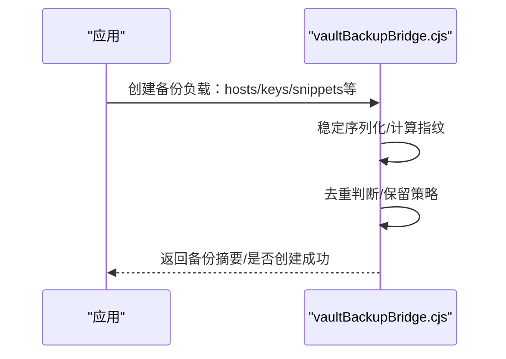

**图表来源**
- [vaultBackupBridge.cjs:74-115](file://electron/bridges/vaultBackupBridge.cjs#L74-L115)

**章节来源**
- [vaultBackupBridge.cjs:74-115](file://electron/bridges/vaultBackupBridge.cjs#L74-L115)
- [vaultBackupBridge.test.cjs:83-117](file://electron/bridges/vaultBackupBridge.test.cjs#L83-L117)

## 依赖关系分析
- 组件耦合
  - HostTreeView 依赖 useVaultHostCollections 的过滤/排序/分组树；依赖 groupConfig 与 host 的显示细节解析。
  - HostDetailsPanel 依赖 groupConfig 合并默认值，依赖 host 规范化与 Telnet 默认值，依赖 HostNotesEditor 进行注释编辑。
  - VaultHostListSection 依赖 HostNotesIndicator 显示注释指示器。
  - VaultView 作为入口，协调树视图、集合计算、已知主机管理与备份桥接。
- 外部依赖
  - 本地存储键用于持久化排序模式与树展开状态。
  - Electron 桥接负责备份/恢复与底层系统能力。

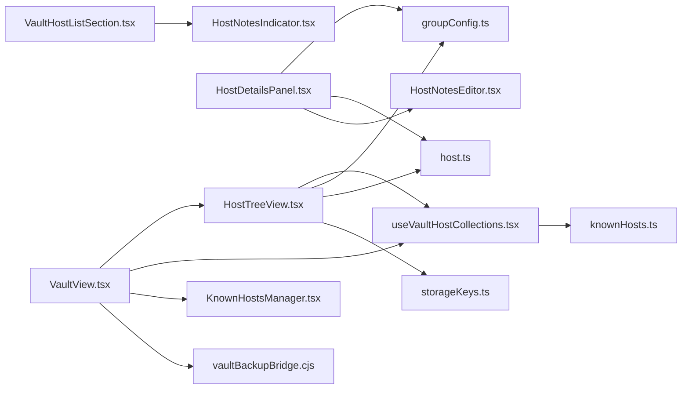

**图表来源**
- [HostTreeView.tsx:448-634](file://components/HostTreeView.tsx#L448-L634)
- [useVaultHostCollections.tsx:24-496](file://components/vault/useVaultHostCollections.tsx#L24-L496)
- [HostDetailsPanel.tsx:83-170](file://components/HostDetailsPanel.tsx#L83-L170)
- [HostNotesEditor.tsx:52-82](file://components/host/HostNotesEditor.tsx#L52-L82)
- [VaultHostListSection.tsx:159](file://components/vault/VaultHostListSection.tsx#L159)
- [groupConfig.ts:30-140](file://domain/groupConfig.ts#L30-L140)
- [host.ts:205-265](file://domain/host.ts#L205-L265)
- [VaultView.tsx:779-836](file://components/VaultView.tsx#L779-L836)
- [KnownHostsManager.tsx:44-82](file://components/KnownHostsManager.tsx#L44-L82)
- [vaultBackupBridge.cjs:74-115](file://electron/bridges/vaultBackupBridge.cjs#L74-L115)
- [storageKeys.ts](file://infrastructure/config/storageKeys.ts)

**章节来源**
- [HostTreeView.tsx:1-634](file://components/HostTreeView.tsx#L1-L634)
- [useVaultHostCollections.tsx:1-496](file://components/vault/useVaultHostCollections.tsx#L1-L496)
- [HostDetailsPanel.tsx:1-964](file://components/HostDetailsPanel.tsx#L1-L964)
- [HostNotesEditor.tsx:1-84](file://components/host/HostNotesEditor.tsx#L1-L84)
- [HostNotesIndicator.tsx:1-40](file://components/host/HostNotesIndicator.tsx#L1-L40)
- [VaultHostListSection.tsx:1-821](file://components/vault/VaultHostListSection.tsx#L1-L821)
- [groupConfig.ts:1-140](file://domain/groupConfig.ts#L1-L140)
- [host.ts:1-265](file://domain/host.ts#L1-L265)
- [VaultView.tsx:779-836](file://components/VaultView.tsx#L779-L836)
- [KnownHostsManager.tsx:1-82](file://components/KnownHostsManager.tsx#L1-L82)
- [vaultBackupBridge.cjs:1-115](file://electron/bridges/vaultBackupBridge.cjs#L1-L115)
- [storageKeys.ts](file://infrastructure/config/storageKeys.ts)

## 性能考量
- 列表渲染优化
  - 使用 useMemo 缓存分组树、过滤后主机列表、排序结果，减少不必要的重算。
  - 树视图与列表视图分别维护独立的数据源，避免相互干扰。
  - 注释指示器采用条件渲染，只有在主机有注释时才显示。
- 拖拽与多选
  - 拖拽事件中仅传递必要数据（主机ID/分组路径），避免深拷贝大对象。
  - 多选模式下仅在点击时切换状态，不触发连接动作。
- 本地存储
  - 排序模式与树展开状态持久化于本地存储，减少每次启动的计算量。
- 导入导出
  - 备份采用稳定序列化与指纹去重，避免重复写入；保留策略限制备份数量，降低磁盘占用。
- 注释系统性能
  - 注释预览内容截断处理，限制最大显示长度。
  - 注释编辑器使用受控组件，避免不必要的重新渲染。

## 故障排查指南
- 无法保存主机
  - 检查主机名是否为空；检查代理配置是否完整（主机/端口/类型）；若代理档案缺失，面板会提示"缺少已保存的代理档案"。
  - 检查注释内容是否符合要求（支持 Markdown 格式）。
  - 参考保存流程与校验逻辑。
- Telnet 连接失败
  - 确认 Telnet 端口是否正确（默认23），用户名/密码是否配置；Telnet 默认值由域逻辑解析。
- 代理配置冲突
  - 若主机已存在代理配置或可用代理档案，将不再继承分组默认代理配置，避免冲突。
- 未知主机密钥
  - 使用已知主机管理导入 known_hosts，或在连接时进行主机密钥验证。
- 备份/恢复异常
  - 检查备份指纹与去重逻辑；确认保留策略与加密选项；查看测试用例以定位问题场景。
- 注释显示问题
  - 检查注释内容是否为空；确认注释指示器的条件渲染逻辑；验证注释预览的截断处理。

**章节来源**
- [HostDetailsPanel.tsx:343-442](file://components/HostDetailsPanel.tsx#L343-L442)
- [host.ts:190-199](file://domain/host.ts#L190-L199)
- [groupConfig.ts:18-85](file://domain/groupConfig.ts#L18-L85)
- [KnownHostsManager.tsx:55-82](file://components/KnownHostsManager.tsx#L55-L82)
- [vaultBackupBridge.cjs:74-115](file://electron/bridges/vaultBackupBridge.cjs#L74-L115)
- [vaultBackupBridge.test.cjs:83-117](file://electron/bridges/vaultBackupBridge.test.cjs#L83-L117)
- [HostNotesIndicator.tsx:22-40](file://components/host/HostNotesIndicator.tsx#L22-L40)

## 结论
该主机管理功能通过"视图层 + 集合计算 + 域逻辑 + 集成桥接"的清晰分层，提供了完整的主机生命周期管理能力：从添加/编辑/删除，到分组/标签/排序/搜索，再到复制凭据、批量选择与导入导出。借助分组默认值与主机规范化，系统在保证灵活性的同时提升了用户体验与一致性。

**更新** 新增的主机注释系统进一步增强了主机管理的功能，支持用户添加和管理主机元数据，提高主机信息的可读性和可维护性。注释系统采用 Markdown 格式支持，既满足了技术文档的需求，又保持了简洁易用的特点。

## 附录

### 实际操作示例与最佳实践
- 添加主机
  - 在分组右键菜单选择"新建主机"，填写别名、主机名/IP、端口、用户名等；如需代理，可在代理面板配置或选择代理档案；在注释区域添加相关说明。
- 编辑主机
  - 右键主机选择"编辑"，在详情面板修改连接参数、认证方式、代理、主题/字体覆盖、链式跳转等；在注释编辑器中更新主机相关信息。
- 删除主机
  - 右键主机选择"删除"，或在详情面板保存前取消。
- 组织分组与标签
  - 右键分组选择"新建分组"创建子分组；在主机详情中设置分组与标签；支持新建标签与重命名/删除标签。
- 移动主机
  - 在树视图中拖拽主机到目标分组；或在详情面板更改分组路径。
- 视图与排序
  - 支持树形/列表/网格视图（网格/列表由保管库视图控制）；排序支持名称升/降、创建时间新/旧、按分组排序；可通过本地存储键持久化排序模式。
- 搜索与过滤
  - 在搜索框输入关键词可跨分组快速定位主机；配合标签过滤进一步缩小范围；注释内容也参与搜索匹配。
- 高级功能
  - 复制凭据：在主机条目右键选择"复制凭据"；批量选择：开启多选模式后勾选多个主机进行统一操作；导入导出：通过备份桥接进行保管库数据的备份与恢复。
- 注释管理
  - 在主机详情面板的注释区域添加 Markdown 格式的注释内容；使用编辑/预览标签页切换查看效果；注释内容会在主机列表中以指示器形式显示。

**章节来源**
- [HostTreeView.tsx:448-634](file://components/HostTreeView.tsx#L448-L634)
- [useVaultHostCollections.tsx:118-295](file://components/vault/useVaultHostCollections.tsx#L118-L295)
- [HostDetailsPanel.tsx:61-800](file://components/HostDetailsPanel.tsx#L61-L800)
- [HostNotesEditor.tsx:1-84](file://components/host/HostNotesEditor.tsx#L1-L84)
- [HostNotesIndicator.tsx:1-40](file://components/host/HostNotesIndicator.tsx#L1-L40)
- [VaultHostListSection.tsx:1-821](file://components/vault/VaultHostListSection.tsx#L1-L821)
- [VaultView.tsx:779-836](file://components/VaultView.tsx#L779-L836)
- [storageKeys.ts](file://infrastructure/config/storageKeys.ts)
- [VaultView.sortPersistence.test.tsx:1-58](file://components/VaultView.sortPersistence.test.tsx#L1-L58)
- [vaultBackupBridge.cjs:74-115](file://electron/bridges/vaultBackupBridge.cjs#L74-L115)