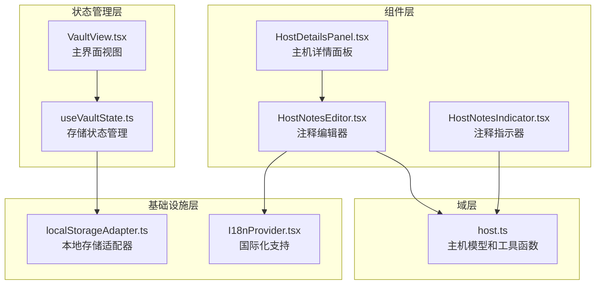
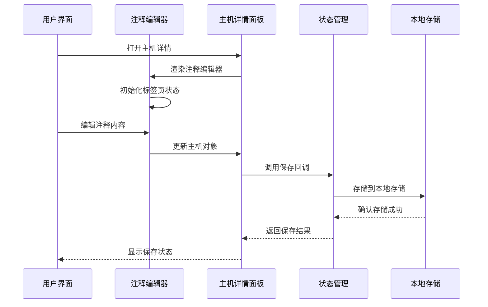
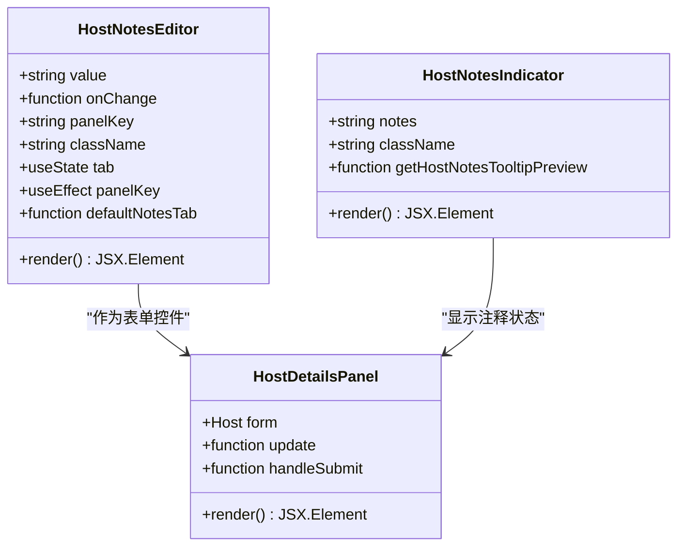
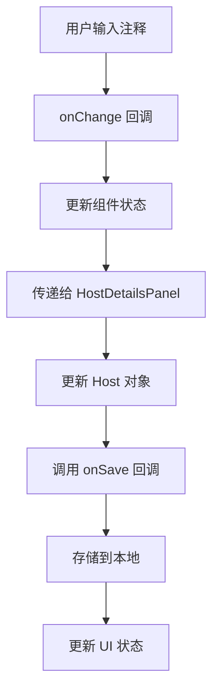
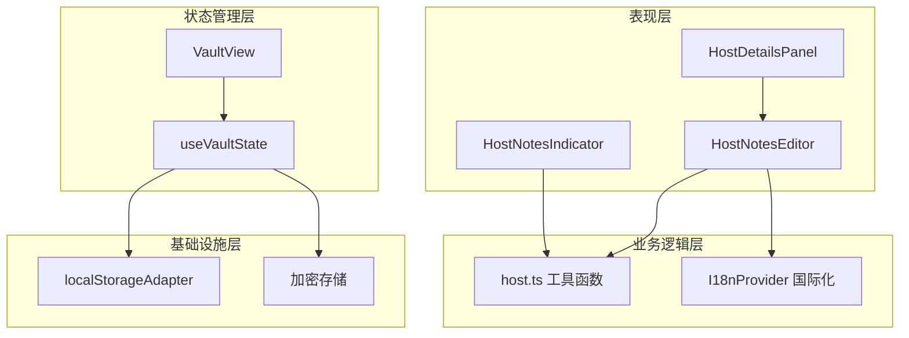

# 主机注释系统

<cite>
**本文档引用的文件**
- [HostNotesEditor.tsx](file://components/host/HostNotesEditor.tsx)
- [HostNotesIndicator.tsx](file://components/host/HostNotesIndicator.tsx)
- [HostDetailsPanel.tsx](file://components/HostDetailsPanel.tsx)
- [host.ts](file://domain/host.ts)
- [useVaultState.ts](file://application/state/useVaultState.ts)
- [VaultView.tsx](file://components/VaultView.tsx)
- [I18nProvider.tsx](file://application/i18n/I18nProvider.tsx)
- [localStorageAdapter.ts](file://infrastructure/persistence/localStorageAdapter.ts)
</cite>

## 目录
1. [简介](#简介)
2. [项目结构](#项目结构)
3. [核心组件](#核心组件)
4. [架构概览](#架构概览)
5. [详细组件分析](#详细组件分析)
6. [依赖关系分析](#依赖关系分析)
7. [性能考虑](#性能考虑)
8. [故障排除指南](#故障排除指南)
9. [结论](#结论)

## 简介

主机注释系统是 Netcatty 应用程序中的一个重要功能模块，允许用户为主机配置添加自定义注释和说明。该系统提供了完整的注释编辑、预览、存储和显示功能，支持 Markdown 格式的富文本内容，并集成了国际化支持和本地存储机制。

系统的核心价值在于：
- 提供直观的注释编辑界面
- 支持实时预览功能
- 实现注释内容的安全存储
- 在主机列表中提供便捷的注释指示器
- 支持多语言国际化

## 项目结构

主机注释系统主要分布在以下目录结构中：

**图表来源**
- [HostNotesEditor.tsx:1-85](file://components/host/HostNotesEditor.tsx#L1-L85)
- [HostNotesIndicator.tsx:1-41](file://components/host/HostNotesIndicator.tsx#L1-L41)
- [host.ts:1-271](file://domain/host.ts#L1-L271)

**章节来源**
- [HostNotesEditor.tsx:1-85](file://components/host/HostNotesEditor.tsx#L1-L85)
- [HostNotesIndicator.tsx:1-41](file://components/host/HostNotesIndicator.tsx#L1-L41)
- [HostDetailsPanel.tsx:770-775](file://components/HostDetailsPanel.tsx#L770-L775)

## 核心组件

### 注释编辑器组件

HostNotesEditor 是系统的核心组件，提供完整的注释编辑功能：

- **双标签页界面**：编辑模式和预览模式
- **Markdown 支持**：通过 MessageResponse 组件实现 Markdown 渲染
- **国际化支持**：使用 I18nProvider 提供多语言界面
- **自动重置功能**：当打开不同主机时自动重置标签页状态

### 注释指示器组件

HostNotesIndicator 为主机列表提供简洁的注释显示：

- **工具提示支持**：鼠标悬停显示注释预览
- **长度限制**：最多显示 160 个字符
- **条件渲染**：仅在存在注释时显示

### 主机详情面板集成

在 HostDetailsPanel 中，注释编辑器作为标准表单控件集成：

- **表单字段**：作为主机配置的一部分
- **数据绑定**：双向数据绑定到主机对象
- **保存流程**：在主机保存时自动处理注释数据

**章节来源**
- [HostNotesEditor.tsx:17-85](file://components/host/HostNotesEditor.tsx#L17-L85)
- [HostNotesIndicator.tsx:13-41](file://components/host/HostNotesIndicator.tsx#L13-L41)
- [HostDetailsPanel.tsx:770-775](file://components/HostDetailsPanel.tsx#L770-L775)

## 架构概览

主机注释系统的整体架构采用分层设计：

**图表来源**
- [HostNotesEditor.tsx:31-40](file://components/host/HostNotesEditor.tsx#L31-L40)
- [HostDetailsPanel.tsx:397-449](file://components/HostDetailsPanel.tsx#L397-L449)
- [useVaultState.ts:146-154](file://application/state/useVaultState.ts#L146-L154)

系统的关键特性包括：

1. **组件化设计**：每个功能模块都是独立的 React 组件
2. **状态管理**：通过 useVaultState 进行集中状态管理
3. **持久化存储**：使用 localStorageAdapter 实现数据持久化
4. **国际化支持**：完整的多语言界面支持
5. **错误处理**：完善的错误处理和边界情况处理

## 详细组件分析

### HostNotesEditor 组件分析

HostNotesEditor 是注释系统的核心组件，具有以下特点：

**图表来源**
- [HostNotesEditor.tsx:17-85](file://components/host/HostNotesEditor.tsx#L17-L85)
- [HostNotesIndicator.tsx:13-41](file://components/host/HostNotesIndicator.tsx#L13-L41)
- [HostDetailsPanel.tsx:174-176](file://components/HostDetailsPanel.tsx#L174-L176)

#### 编辑器功能特性

1. **双标签页界面**：
   - 编辑标签页：使用 Textarea 进行文本编辑
   - 预览标签页：实时预览 Markdown 内容

2. **智能标签页切换**：
   - 根据注释内容自动决定默认标签页
   - 当打开不同主机时重置标签页状态

3. **国际化支持**：
   - 使用 I18nProvider 提供多语言界面
   - 支持多种语言的界面文本

#### 数据处理流程

**图表来源**
- [HostNotesEditor.tsx:62-68](file://components/host/HostNotesEditor.tsx#L62-L68)
- [HostDetailsPanel.tsx:397-449](file://components/HostDetailsPanel.tsx#L397-L449)

**章节来源**
- [HostNotesEditor.tsx:1-85](file://components/host/HostNotesEditor.tsx#L1-L85)
- [HostNotesIndicator.tsx:1-41](file://components/host/HostNotesIndicator.tsx#L1-L41)

### HostNotesIndicator 组件分析

HostNotesIndicator 提供了简洁的注释状态指示功能：

#### 工具提示预览功能

组件实现了智能的注释预览功能：

1. **长度截断**：最多显示 160 个字符
2. **格式化处理**：去除多余空白字符
3. **省略号处理**：超过长度限制时显示省略号

#### 条件渲染优化

- 仅在存在注释内容时渲染组件
- 避免不必要的 DOM 元素创建
- 提升界面性能

**章节来源**
- [HostNotesIndicator.tsx:5-11](file://components/host/HostNotesIndicator.tsx#L5-L11)
- [HostNotesIndicator.tsx:22-40](file://components/host/HostNotesIndicator.tsx#L22-L40)

### 主机模型和数据处理

系统使用 domain/host.ts 中的工具函数处理主机数据：

#### 数据清理和验证

sanitizeHost 函数负责注释数据的清理：

1. **注释修剪**：自动去除注释内容的前后空白
2. **数据标准化**：确保注释格式的一致性
3. **边界情况处理**：处理空值和 undefined 情况

#### 主机数据结构

主机对象包含以下注释相关字段：
- `notes`: 主机注释内容
- `notes?.trim()`: 清理后的注释内容
- 支持空注释的优雅处理

**章节来源**
- [host.ts:250-270](file://domain/host.ts#L250-L270)

## 依赖关系分析

主机注释系统的依赖关系呈现清晰的层次结构：

**图表来源**
- [HostNotesEditor.tsx:1-85](file://components/host/HostNotesEditor.tsx#L1-L85)
- [useVaultState.ts:146-154](file://application/state/useVaultState.ts#L146-L154)
- [localStorageAdapter.ts:47-68](file://infrastructure/persistence/localStorageAdapter.ts#L47-L68)

### 关键依赖关系

1. **组件依赖**：
   - HostNotesEditor 依赖 I18nProvider 进行国际化
   - HostNotesIndicator 依赖 Tooltip 组件
   - HostDetailsPanel 集成注释编辑器

2. **状态管理依赖**：
   - useVaultState 提供集中状态管理
   - localStorageAdapter 处理数据持久化
   - 加密存储确保数据安全

3. **工具函数依赖**：
   - domain/host.ts 提供数据清理和验证
   - 国际化消息提供多语言支持

**章节来源**
- [I18nProvider.tsx:1-38](file://application/i18n/I18nProvider.tsx#L1-L38)
- [useVaultState.ts:127-154](file://application/state/useVaultState.ts#L127-L154)

## 性能考虑

主机注释系统在设计时充分考虑了性能优化：

### 渲染优化

1. **条件渲染**：注释指示器仅在有内容时渲染
2. **状态分离**：编辑器和指示器的状态相互独立
3. **懒加载**：大型组件按需加载

### 存储优化

1. **增量更新**：仅更新受影响的数据
2. **防抖处理**：避免频繁的存储操作
3. **内存管理**：及时清理不再使用的数据

### 数据处理优化

1. **批量操作**：支持批量数据处理
2. **缓存策略**：合理使用缓存减少重复计算
3. **异步处理**：长时间操作使用异步处理避免阻塞

## 故障排除指南

### 常见问题及解决方案

#### 注释内容丢失问题

**症状**：注释内容在页面刷新后丢失

**原因分析**：
- 本地存储权限问题
- 数据序列化/反序列化错误
- 状态管理异常

**解决步骤**：
1. 检查浏览器存储权限
2. 验证数据格式正确性
3. 查看控制台错误信息

#### 国际化显示问题

**症状**：注释界面显示为英文或乱码

**解决方法**：
1. 确认 I18nProvider 正确初始化
2. 检查语言包完整性
3. 验证消息键值正确性

#### 性能问题

**症状**：界面响应缓慢或卡顿

**优化措施**：
1. 检查组件渲染次数
2. 优化数据处理逻辑
3. 实施适当的缓存策略

**章节来源**
- [localStorageAdapter.ts:47-68](file://infrastructure/persistence/localStorageAdapter.ts#L47-L68)
- [I18nProvider.tsx:24-32](file://application/i18n/I18nProvider.tsx#L24-L32)

## 结论

主机注释系统是一个设计精良的功能模块，具有以下显著优势：

### 技术优势

1. **模块化设计**：清晰的组件分离和职责划分
2. **状态管理**：集中化的状态管理和持久化机制
3. **用户体验**：直观的界面设计和流畅的交互体验
4. **国际化支持**：完整的多语言支持
5. **数据安全**：采用加密存储保护用户数据

### 功能完整性

系统提供了完整的注释生命周期管理：
- 注释创建和编辑
- 实时预览和渲染
- 数据持久化存储
- 界面状态同步
- 错误处理和边界情况

### 扩展性考虑

系统架构为未来的功能扩展预留了良好的基础：
- 插件化组件设计
- 可配置的主题系统
- 支持更多注释格式
- 集成更多协作功能

主机注释系统成功地将复杂的功能需求简化为直观易用的用户界面，为 Netcatty 应用程序提供了重要的增强功能。