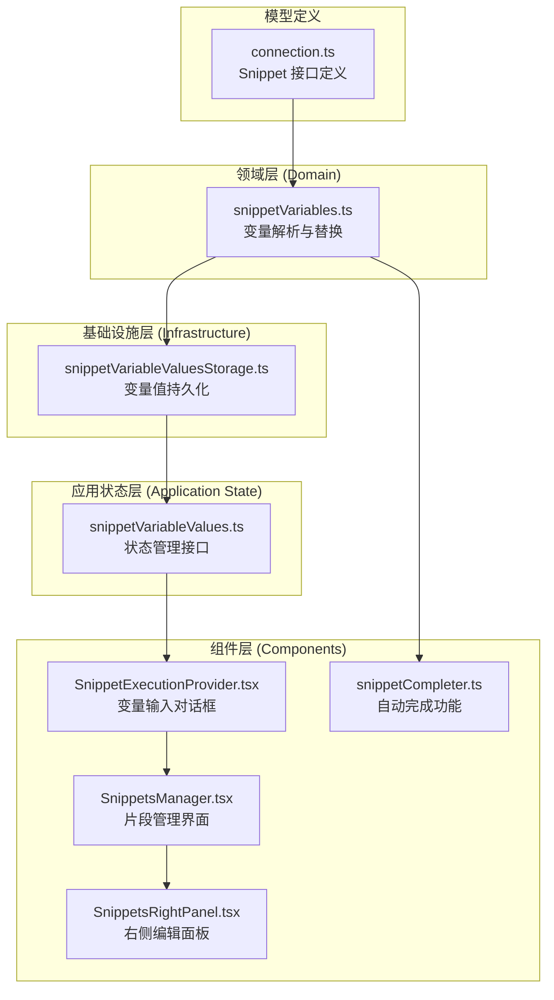
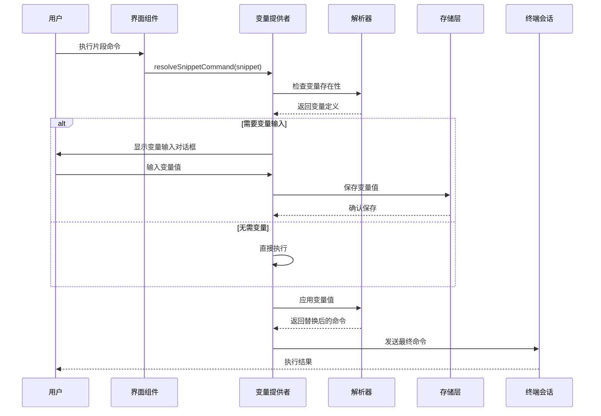
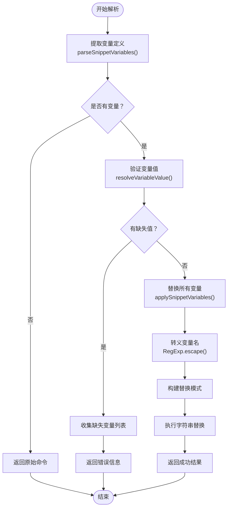
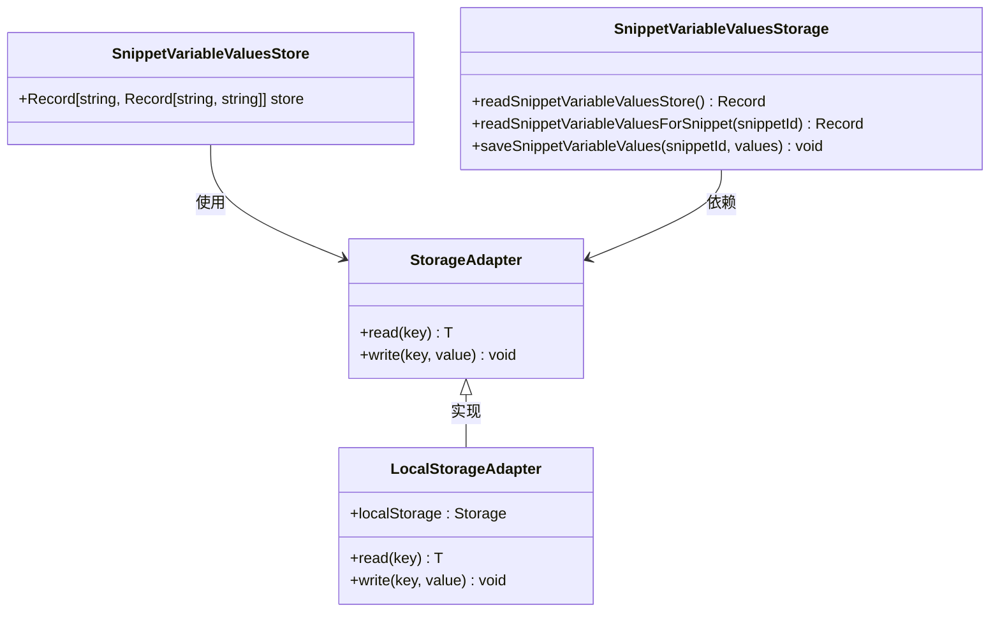
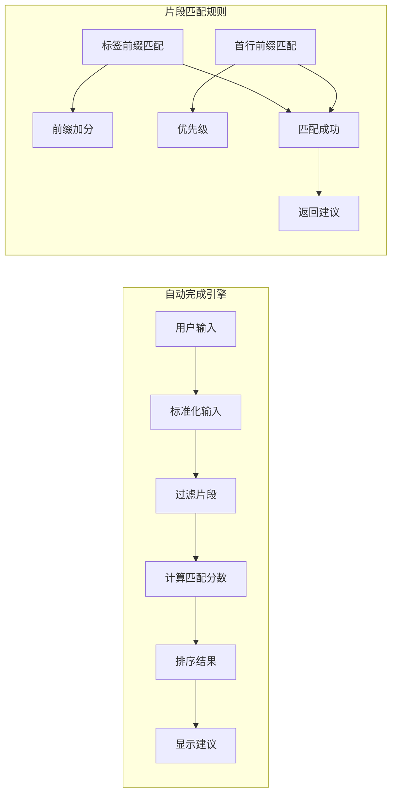
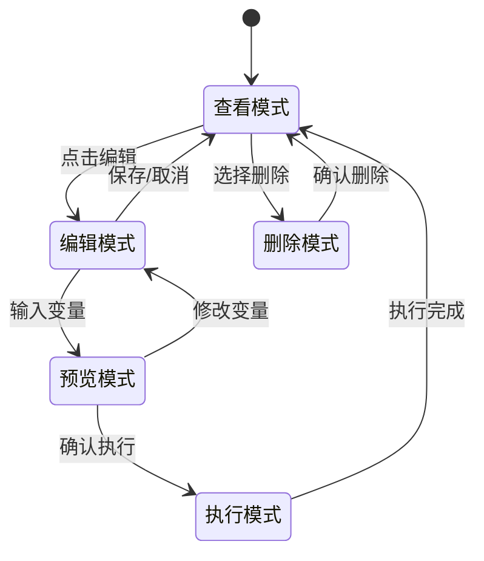
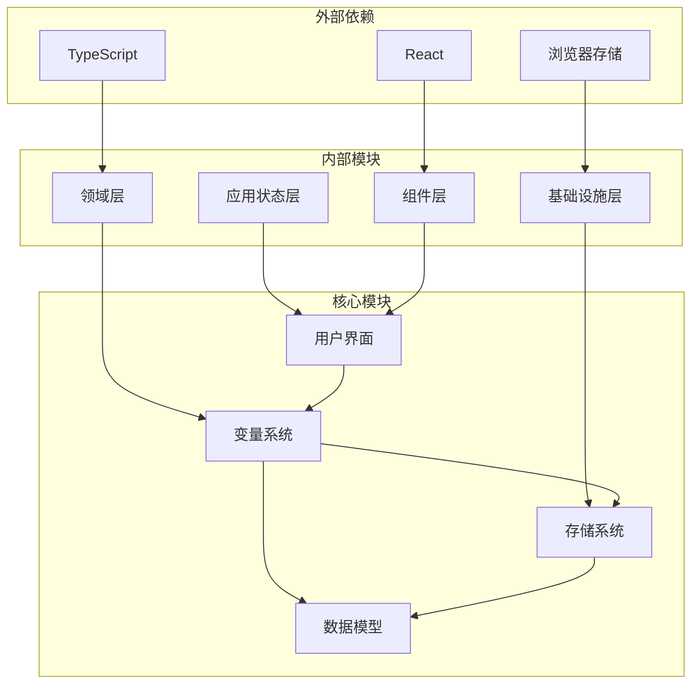

# 代码片段变量系统

<cite>
**本文档引用的文件**
- [snippetVariables.ts](file://domain/snippetVariables.ts)
- [snippetVariables.test.ts](file://domain/snippetVariables.test.ts)
- [snippetVariableValuesStorage.ts](file://infrastructure/persistence/snippetVariableValuesStorage.ts)
- [snippetVariableValues.ts](file://application/state/snippetVariableValues.ts)
- [SnippetExecutionProvider.tsx](file://components/SnippetExecutionProvider.tsx)
- [SnippetsManager.tsx](file://components/SnippetsManager.tsx)
- [SnippetsRightPanel.tsx](file://components/SnippetsRightPanel.tsx)
- [snippetCompleter.ts](file://components/terminal/autocomplete/snippetCompleter.ts)
- [connection.ts](file://domain/models/connection.ts)
</cite>

## 目录
1. [简介](#简介)
2. [项目结构](#项目结构)
3. [核心组件](#核心组件)
4. [架构概览](#架构概览)
5. [详细组件分析](#详细组件分析)
6. [依赖关系分析](#依赖关系分析)
7. [性能考虑](#性能考虑)
8. [故障排除指南](#故障排除指南)
9. [结论](#结论)

## 简介

代码片段变量系统是 Netcatty 应用程序中的一个核心功能模块，它允许用户在终端会话中执行可参数化的命令片段。该系统通过解析命令模板中的占位符变量、收集用户输入、应用默认值以及持久化用户选择来提供灵活的命令执行体验。

系统支持多种变量格式，包括基础变量 `{{variable}}` 和带默认值的变量 `{{variable:default}}`，并通过本地存储机制记住用户的变量选择，提供智能的自动完成和预览功能。

## 项目结构

代码片段变量系统分布在应用程序的多个层次中：



**图表来源**
- [snippetVariables.ts:1-118](file://domain/snippetVariables.ts#L1-L118)
- [snippetVariableValuesStorage.ts:1-22](file://infrastructure/persistence/snippetVariableValuesStorage.ts#L1-L22)
- [SnippetExecutionProvider.tsx:1-235](file://components/SnippetExecutionProvider.tsx#L1-L235)

**章节来源**
- [snippetVariables.ts:1-118](file://domain/snippetVariables.ts#L1-L118)
- [snippetVariableValuesStorage.ts:1-22](file://infrastructure/persistence/snippetVariableValuesStorage.ts#L1-L22)

## 核心组件

### 变量解析器 (Variable Parser)

变量解析器是系统的核心组件，负责识别和处理命令模板中的变量占位符。它支持两种变量格式：

1. **基础变量**: `{{variable}}` - 必需变量，必须由用户提供值
2. **带默认值变量**: `{{variable:default}}` - 可选变量，如果用户未提供值则使用默认值

解析器使用正则表达式模式 `\{\{([^}:]+)(?::([^}]*))?\}\}` 来匹配变量占位符，并确保每个变量只被识别一次。

### 变量值存储 (Variable Value Storage)

系统使用本地存储机制来持久化用户的变量选择，确保在重新打开应用时能够记住之前的输入。存储结构采用嵌套对象形式：

```typescript
type SnippetVariableValuesStore = Record<string, Record<string, string>>;
```

其中：
- 外层键：片段 ID
- 内层键：变量名称
- 值：用户输入或默认值

### 变量输入对话框 (Variable Input Dialog)

SnippetExecutionProvider 组件提供了一个模态对话框，用于收集用户输入的变量值。该对话框具有以下特性：

- **智能初始化**: 从缓存中读取之前保存的值，如果没有则使用默认值
- **实时预览**: 在用户输入时显示命令的预览效果
- **表单验证**: 确保必需变量得到正确填充
- **键盘导航**: 支持 Enter 键快速提交

**章节来源**
- [SnippetExecutionProvider.tsx:1-235](file://components/SnippetExecutionProvider.tsx#L1-L235)
- [snippetVariableValuesStorage.ts:1-22](file://infrastructure/persistence/snippetVariableValuesStorage.ts#L1-L22)

## 架构概览

代码片段变量系统采用分层架构设计，确保关注点分离和模块化：



**图表来源**
- [SnippetExecutionProvider.tsx:214-234](file://components/SnippetExecutionProvider.tsx#L214-L234)
- [snippetVariables.ts:58-95](file://domain/snippetVariables.ts#L58-L95)

## 详细组件分析

### 变量解析流程

系统使用正则表达式进行变量识别和替换，确保处理效率和准确性：



**图表来源**
- [snippetVariables.ts:21-95](file://domain/snippetVariables.ts#L21-L95)

### 变量存储机制

存储系统采用分层设计，确保数据的一致性和可靠性：



**图表来源**
- [snippetVariableValuesStorage.ts:1-22](file://infrastructure/persistence/snippetVariableValuesStorage.ts#L1-L22)

### 自动完成功能

系统集成了智能的自动完成功能，为用户提供更好的用户体验：



**图表来源**
- [snippetCompleter.ts:19-49](file://components/terminal/autocomplete/snippetCompleter.ts#L19-L49)

**章节来源**
- [snippetVariables.ts:1-118](file://domain/snippetVariables.ts#L1-L118)
- [snippetCompleter.ts:1-50](file://components/terminal/autocomplete/snippetCompleter.ts#L1-L50)

### 片段管理界面

SnippetsManager 和 SnippetsRightPanel 提供了完整的片段管理功能：



**图表来源**
- [SnippetsManager.tsx:652-692](file://components/SnippetsManager.tsx#L652-L692)
- [SnippetsRightPanel.tsx:84-200](file://components/SnippetsRightPanel.tsx#L84-L200)

**章节来源**
- [SnippetsManager.tsx:1-800](file://components/SnippetsManager.tsx#L1-L800)
- [SnippetsRightPanel.tsx:1-200](file://components/SnippetsRightPanel.tsx#L1-L200)

## 依赖关系分析

系统采用清晰的依赖关系设计，避免循环依赖并确保模块间的松耦合：



**图表来源**
- [snippetVariables.ts:1-118](file://domain/snippetVariables.ts#L1-L118)
- [snippetVariableValuesStorage.ts:1-22](file://infrastructure/persistence/snippetVariableValuesStorage.ts#L1-L22)

**章节来源**
- [connection.ts:214-230](file://domain/models/connection.ts#L214-L230)

## 性能考虑

系统在设计时充分考虑了性能优化：

### 正则表达式优化
- 使用非全局正则表达式避免 `lastIndex` 问题
- 单次遍历完成变量识别和去重
- 动态构建替换模式以提高匹配效率

### 内存管理
- 使用 `Set` 进行变量去重，时间复杂度 O(n)
- 智能缓存机制避免重复计算
- 及时清理临时变量和闭包引用

### 用户体验优化
- 实时预览功能仅在需要时更新
- 表单验证采用防抖机制
- 自动完成使用虚拟滚动处理大量数据

## 故障排除指南

### 常见问题及解决方案

**问题1: 变量未正确替换**
- 检查变量语法是否正确：`{{variable}}` 或 `{{variable:default}}`
- 确认变量名称不包含特殊字符
- 验证变量值是否为空字符串

**问题2: 变量值未保存**
- 检查浏览器存储权限设置
- 确认应用具有写入本地存储的权限
- 验证存储键名是否正确

**问题3: 自动完成不工作**
- 检查片段标签和命令内容
- 确认主机目标过滤逻辑正常
- 验证匹配算法的优先级设置

**问题4: 性能问题**
- 检查正则表达式的复杂度
- 优化变量数量和嵌套深度
- 考虑实现变量值缓存机制

**章节来源**
- [snippetVariables.test.ts:1-77](file://domain/snippetVariables.test.ts#L1-L77)

## 结论

代码片段变量系统通过精心设计的架构和实现，为用户提供了强大而灵活的命令执行能力。系统的主要优势包括：

1. **灵活性**: 支持必需变量和可选变量，满足不同场景需求
2. **易用性**: 提供直观的用户界面和智能的自动完成功能
3. **可靠性**: 采用本地存储确保用户数据的安全和持久性
4. **性能**: 优化的算法和数据结构保证系统的响应速度
5. **可维护性**: 清晰的分层架构便于后续的功能扩展和维护

该系统不仅提升了用户的工作效率，还为 Netcatty 应用程序的整体功能完整性做出了重要贡献。通过持续的优化和改进，代码片段变量系统将继续为用户提供卓越的使用体验。