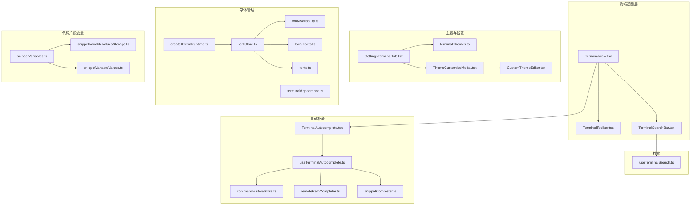
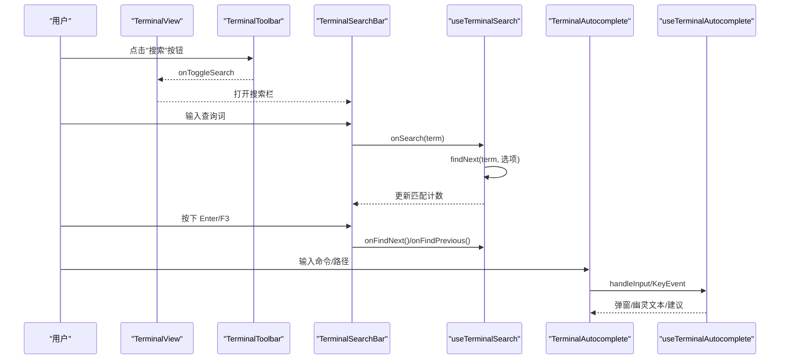
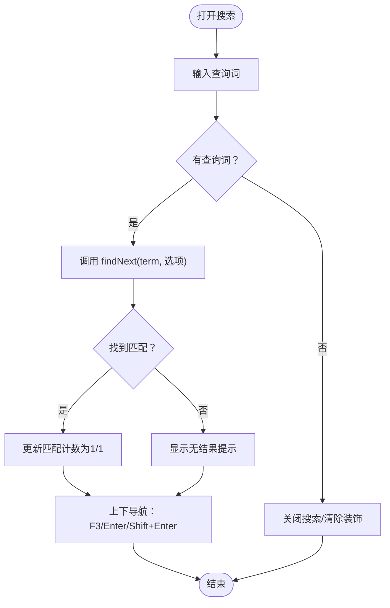
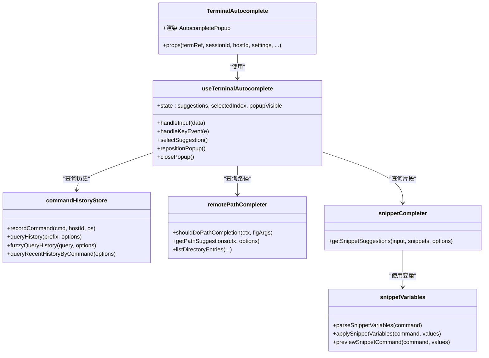
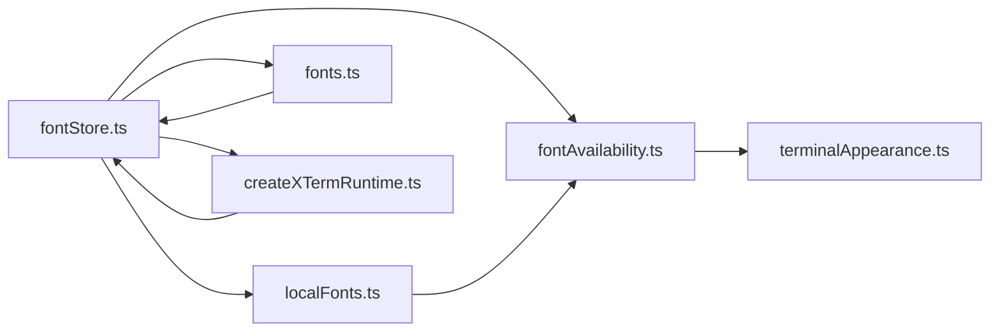
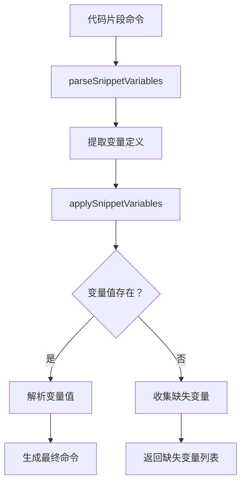
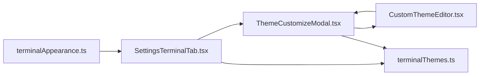
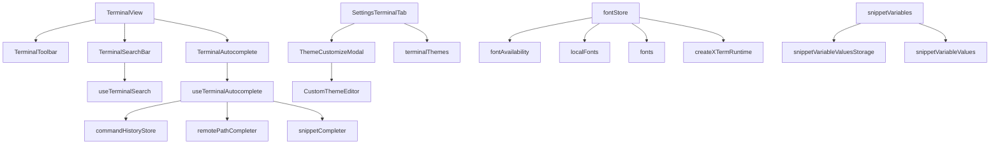

# 终端功能

<cite>
**本文引用的文件**
- [TerminalView.tsx](file://components/terminal/TerminalView.tsx)
- [TerminalToolbar.tsx](file://components/terminal/TerminalToolbar.tsx)
- [TerminalSearchBar.tsx](file://components/terminal/TerminalSearchBar.tsx)
- [useTerminalSearch.ts](file://components/terminal/hooks/useTerminalSearch.ts)
- [TerminalAutocomplete.tsx](file://components/terminal/TerminalAutocomplete.tsx)
- [useTerminalAutocomplete.ts](file://components/terminal/autocomplete/useTerminalAutocomplete.ts)
- [commandHistoryStore.ts](file://components/terminal/autocomplete/commandHistoryStore.ts)
- [snippetCompleter.ts](file://components/terminal/autocomplete/snippetCompleter.ts)
- [remotePathCompleter.ts](file://components/terminal/autocomplete/remotePathCompleter.ts)
- [SettingsTerminalTab.tsx](file://components/settings/tabs/SettingsTerminalTab.tsx)
- [SettingsTerminalTabControls.tsx](file://components/settings/tabs/SettingsTerminalTabControls.tsx)
- [CustomThemeEditor.tsx](file://components/terminal/CustomThemeEditor.tsx)
- [ThemeCustomizeModal.tsx](file://components/terminal/ThemeCustomizeModal.tsx)
- [terminalThemes.ts](file://infrastructure/config/terminalThemes.ts)
- [fontStore.ts](file://application/state/fontStore.ts)
- [fonts.ts](file://infrastructure/config/fonts.ts)
- [fontAvailability.ts](file://lib/fontAvailability.ts)
- [localFonts.ts](file://lib/localFonts.ts)
- [createXTermRuntime.ts](file://components/terminal/runtime/createXTermRuntime.ts)
- [terminalAppearance.ts](file://domain/terminalAppearance.ts)
- [snippetVariables.ts](file://domain/snippetVariables.ts)
- [snippetVariableValuesStorage.ts](file://infrastructure/persistence/snippetVariableValuesStorage.ts)
- [snippetVariableValues.ts](file://application/state/snippetVariableValues.ts)
</cite>

## 更新摘要
**所做更改**
- 新增字体管理系统章节，涵盖字体存储、可用性检测和字体选择
- 新增代码片段变量系统章节，介绍变量解析、值存储和应用机制
- 更新终端外观检测章节，说明主题跟随应用主题的功能
- 扩展字体配置章节，包含本地字体发现和字体可用性检测
- 更新自动补全系统章节，增加代码片段变量支持

## 目录
1. [简介](#简介)
2. [项目结构](#项目结构)
3. [核心组件](#核心组件)
4. [架构总览](#架构总览)
5. [详细组件分析](#详细组件分析)
6. [依赖关系分析](#依赖关系分析)
7. [性能考量](#性能考量)
8. [故障排查指南](#故障排查指南)
9. [结论](#结论)
10. [附录](#附录)

## 简介
本指南面向终端功能模块的使用者与维护者，系统讲解终端视图的操作界面、自动补全、搜索、主题定制、工具栏功能以及会话管理最佳实践。文档以仓库中的实际实现为依据，配合可视化图示帮助理解终端各子系统的协作方式。

**更新** 本次更新重点介绍了新增的字体管理系统、代码片段变量系统和终端外观检测改进。

## 项目结构
终端功能由"视图层 + 搜索钩子 + 自动补全引擎 + 主题配置 + 设置面板 + 字体管理 + 代码片段变量"构成，核心文件分布如下：
- 视图与交互：TerminalView、TerminalToolbar、TerminalSearchBar
- 搜索逻辑：useTerminalSearch（基于 xterm-addon-search）
- 自动补全：TerminalAutocomplete、useTerminalAutocomplete、命令历史、远程路径、代码片段
- 主题系统：SettingsTerminalTab、ThemeCustomizeModal、CustomThemeEditor、terminalThemes
- 字体管理：fontStore、fonts、fontAvailability、localFonts、createXTermRuntime
- 代码片段变量：snippetVariables、snippetVariableValuesStorage、snippetVariableValues
- 配置与存储：commandHistoryStore、remotePathCompleter、snippetCompleter

**图表来源**
- [TerminalView.tsx:1-638](file://components/terminal/TerminalView.tsx#L1-L638)
- [TerminalToolbar.tsx:1-271](file://components/terminal/TerminalToolbar.tsx#L1-L271)
- [TerminalSearchBar.tsx:1-173](file://components/terminal/TerminalSearchBar.tsx#L1-L173)
- [useTerminalSearch.ts:1-103](file://components/terminal/hooks/useTerminalSearch.ts#L1-L103)
- [TerminalAutocomplete.tsx:1-119](file://components/terminal/TerminalAutocomplete.tsx#L1-L119)
- [useTerminalAutocomplete.ts:1-800](file://components/terminal/autocomplete/useTerminalAutocomplete.ts#L1-L800)
- [commandHistoryStore.ts:1-403](file://components/terminal/autocomplete/commandHistoryStore.ts#L1-L403)
- [remotePathCompleter.ts:1-499](file://components/terminal/autocomplete/remotePathCompleter.ts#L1-L499)
- [snippetCompleter.ts:1-50](file://components/terminal/autocomplete/snippetCompleter.ts#L1-L50)
- [SettingsTerminalTab.tsx:1-975](file://components/settings/tabs/SettingsTerminalTab.tsx#L1-L975)
- [ThemeCustomizeModal.tsx:1-815](file://components/terminal/ThemeCustomizeModal.tsx#L1-L815)
- [CustomThemeEditor.tsx:1-188](file://components/terminal/CustomThemeEditor.tsx#L1-L188)
- [terminalThemes.ts:1-43](file://infrastructure/config/terminalThemes.ts#L1-L43)
- [fontStore.ts:1-161](file://application/state/fontStore.ts#L1-L161)
- [fonts.ts:1-103](file://infrastructure/config/fonts.ts#L1-L103)
- [fontAvailability.ts:1-163](file://lib/fontAvailability.ts#L1-L163)
- [localFonts.ts:141-175](file://lib/localFonts.ts#L141-L175)
- [createXTermRuntime.ts:186-229](file://components/terminal/runtime/createXTermRuntime.ts#L186-L229)
- [terminalAppearance.ts:1-230](file://domain/terminalAppearance.ts#L1-L230)
- [snippetVariables.ts:1-118](file://domain/snippetVariables.ts#L1-L118)
- [snippetVariableValuesStorage.ts:1-22](file://infrastructure/persistence/snippetVariableValuesStorage.ts#L1-L22)
- [snippetVariableValues.ts:1-5](file://application/state/snippetVariableValues.ts#L1-L5)

**章节来源**
- [TerminalView.tsx:1-638](file://components/terminal/TerminalView.tsx#L1-L638)
- [SettingsTerminalTab.tsx:1-975](file://components/settings/tabs/SettingsTerminalTab.tsx#L1-L975)

## 核心组件
- 终端视图 TerminalView：承载状态栏、工具栏、搜索栏、xterm 容器、自动补全弹窗、连接对话框、ZMODEM 进度等。
- 工具栏 TerminalToolbar：提供 SFTP、脚本、主题、编码切换、搜索、组合栏等高频入口。
- 搜索条 TerminalSearchBar + 钩子 useTerminalSearch：提供滚动缓冲区内的文本搜索、正则/大小写/单词匹配选项、结果导航。
- 自动补全 TerminalAutocomplete + useTerminalAutocomplete：统一处理提示检测、幽灵文本、弹窗、键盘交互、输入去抖、远程路径与命令历史/代码片段补全。
- 主题设置 SettingsTerminalTab + ThemeCustomizeModal + CustomThemeEditor：支持内置主题、自定义主题、导入 .itermcolors、字体与字号、光标样式、对比度等。
- 字体管理系统 fontStore + fonts + fontAvailability：提供字体存储、可用性检测、本地字体发现和字体选择功能。
- 代码片段变量系统 snippetVariables + snippetVariableValuesStorage：支持代码片段中的变量解析、默认值设置和值持久化存储。
- 命令历史 commandHistoryStore：持久化记录并按频率与时间衰减评分排序。
- 远程路径补全 remotePathCompleter：基于 IPC 列举目录、缓存、过滤、相对/绝对路径解析。
- 代码片段补全 snippetCompleter：基于标签与首行前缀匹配，优先级高于历史。

**章节来源**
- [TerminalView.tsx:1-638](file://components/terminal/TerminalView.tsx#L1-L638)
- [TerminalToolbar.tsx:1-271](file://components/terminal/TerminalToolbar.tsx#L1-L271)
- [TerminalSearchBar.tsx:1-173](file://components/terminal/TerminalSearchBar.tsx#L1-L173)
- [useTerminalSearch.ts:1-103](file://components/terminal/hooks/useTerminalSearch.ts#L1-L103)
- [TerminalAutocomplete.tsx:1-119](file://components/terminal/TerminalAutocomplete.tsx#L1-L119)
- [useTerminalAutocomplete.ts:1-800](file://components/terminal/autocomplete/useTerminalAutocomplete.ts#L1-L800)
- [commandHistoryStore.ts:1-403](file://components/terminal/autocomplete/commandHistoryStore.ts#L1-L403)
- [remotePathCompleter.ts:1-499](file://components/terminal/autocomplete/remotePathCompleter.ts#L1-L499)
- [snippetCompleter.ts:1-50](file://components/terminal/autocomplete/snippetCompleter.ts#L1-L50)
- [SettingsTerminalTab.tsx:1-975](file://components/settings/tabs/SettingsTerminalTab.tsx#L1-L975)
- [ThemeCustomizeModal.tsx:1-815](file://components/terminal/ThemeCustomizeModal.tsx#L1-L815)
- [CustomThemeEditor.tsx:1-188](file://components/terminal/CustomThemeEditor.tsx#L1-L188)
- [terminalThemes.ts:1-43](file://infrastructure/config/terminalThemes.ts#L1-L43)
- [fontStore.ts:1-161](file://application/state/fontStore.ts#L1-L161)
- [fonts.ts:1-103](file://infrastructure/config/fonts.ts#L1-L103)
- [fontAvailability.ts:1-163](file://lib/fontAvailability.ts#L1-L163)
- [localFonts.ts:141-175](file://lib/localFonts.ts#L141-L175)
- [createXTermRuntime.ts:186-229](file://components/terminal/runtime/createXTermRuntime.ts#L186-L229)
- [terminalAppearance.ts:1-230](file://domain/terminalAppearance.ts#L1-L230)
- [snippetVariables.ts:1-118](file://domain/snippetVariables.ts#L1-L118)
- [snippetVariableValuesStorage.ts:1-22](file://infrastructure/persistence/snippetVariableValuesStorage.ts#L1-L22)
- [snippetVariableValues.ts:1-5](file://application/state/snippetVariableValues.ts#L1-L5)

## 架构总览
终端功能采用"视图容器 + 可插拔子系统"的分层设计：
- 视图层负责布局与事件分发（拖拽、右键菜单、状态栏、工具栏）。
- 搜索与自动补全通过独立钩子/组件注入，避免频繁重渲染。
- 主题系统通过设置面板与主题模态框解耦，支持实时预览与持久化。
- 字体管理系统提供全局字体存储和可用性检测，支持本地字体发现。
- 代码片段变量系统提供变量解析和持久化存储功能。

**图表来源**
- [TerminalView.tsx:1-638](file://components/terminal/TerminalView.tsx#L1-L638)
- [TerminalToolbar.tsx:1-271](file://components/terminal/TerminalToolbar.tsx#L1-L271)
- [TerminalSearchBar.tsx:1-173](file://components/terminal/TerminalSearchBar.tsx#L1-L173)
- [useTerminalSearch.ts:1-103](file://components/terminal/hooks/useTerminalSearch.ts#L1-L103)
- [TerminalAutocomplete.tsx:1-119](file://components/terminal/TerminalAutocomplete.tsx#L1-L119)
- [useTerminalAutocomplete.ts:1-800](file://components/terminal/autocomplete/useTerminalAutocomplete.ts#L1-L800)

## 详细组件分析

### 终端视图与工具栏
- 视图容器负责：
  - 状态栏显示主机名、连接状态、复制主机名、服务器统计（CPU/内存/磁盘/网络）。
  - 工具栏按钮：打开 SFTP、脚本、主题、编码切换、搜索、组合栏、关闭会话。
  - 搜索栏在顶部覆盖层，支持快捷键与结果导航。
  - 自动补全弹窗通过 Portal 渲染到 body，避免容器溢出。
  - 连接对话框、ZMODEM 传输进度与冲突确认。
- 工具栏行为：
  - 搜索开关与高亮显示；组合栏开关；编码切换仅对 SSH/Telnet/串口生效。
  - SFTP 按钮在本地/串口会隐藏；连接未建立时禁用。

**章节来源**
- [TerminalView.tsx:1-638](file://components/terminal/TerminalView.tsx#L1-L638)
- [TerminalToolbar.tsx:1-271](file://components/terminal/TerminalToolbar.tsx#L1-L271)

### 终端搜索功能
- 组件 TerminalSearchBar 提供输入框、匹配计数、上一项/下一项导航按钮。
- 钩子 useTerminalSearch：
  - 默认启用装饰样式（当前匹配高亮），可扩展正则/大小写/整词选项。
  - 支持 Esc 关闭、Enter/F3 导航、Shift+Enter 向前。
  - 提供 clearDecorations、findNext/findPrevious、handleToggleSearch、handleCloseSearch。

**图表来源**
- [TerminalSearchBar.tsx:1-173](file://components/terminal/TerminalSearchBar.tsx#L1-L173)
- [useTerminalSearch.ts:1-103](file://components/terminal/hooks/useTerminalSearch.ts#L1-L103)

**章节来源**
- [TerminalSearchBar.tsx:1-173](file://components/terminal/TerminalSearchBar.tsx#L1-L173)
- [useTerminalSearch.ts:1-103](file://components/terminal/hooks/useTerminalSearch.ts#L1-L103)

### 自动补全系统
- TerminalAutocomplete 将自动补全钩子与弹窗分离，仅在可见且有建议时渲染弹窗，降低重渲染成本。
- useTerminalAutocomplete：
  - 提示检测、幽灵文本策略、弹窗位置计算、键盘交互（Tab/方向键/Enter/Esc）。
  - 输入去抖、快速打字抑制、光标不在行尾时抑制补全。
  - 统一查询命令历史、远程路径、代码片段，避免重复请求。
  - 子目录面板级联展开、路径拼接与转义、Live Preview 写入序列。
  - **新增** 代码片段变量支持，允许在代码片段中使用 {{variable}} 和 {{variable:default}} 语法。
- 命令历史 commandHistoryStore：
  - 持久化存储、按频率与时间衰减评分、限制总量与每主机上限。
  - 支持前缀匹配、模糊匹配、最近命令示例查询。
- 远程路径补全 remotePathCompleter：
  - 基于 IPC 列举目录，带 TTL 缓存、过滤缓存、飞行请求去重。
  - 路径规范化、相对/绝对解析、文件/目录类型排序。
- 代码片段补全 snippetCompleter：
  - 基于标签与首行前缀匹配，优先级高于历史。
  - **更新** 支持变量解析和值应用。

**图表来源**
- [TerminalAutocomplete.tsx:1-119](file://components/terminal/TerminalAutocomplete.tsx#L1-L119)
- [useTerminalAutocomplete.ts:1-800](file://components/terminal/autocomplete/useTerminalAutocomplete.ts#L1-L800)
- [commandHistoryStore.ts:1-403](file://components/terminal/autocomplete/commandHistoryStore.ts#L1-L403)
- [remotePathCompleter.ts:1-499](file://components/terminal/autocomplete/remotePathCompleter.ts#L1-L499)
- [snippetCompleter.ts:1-50](file://components/terminal/autocomplete/snippetCompleter.ts#L1-L50)
- [snippetVariables.ts:1-118](file://domain/snippetVariables.ts#L1-L118)

**章节来源**
- [TerminalAutocomplete.tsx:1-119](file://components/terminal/TerminalAutocomplete.tsx#L1-L119)
- [useTerminalAutocomplete.ts:1-800](file://components/terminal/autocomplete/useTerminalAutocomplete.ts#L1-L800)
- [commandHistoryStore.ts:1-403](file://components/terminal/autocomplete/commandHistoryStore.ts#L1-L403)
- [remotePathCompleter.ts:1-499](file://components/terminal/autocomplete/remotePathCompleter.ts#L1-L499)
- [snippetCompleter.ts:1-50](file://components/terminal/autocomplete/snippetCompleter.ts#L1-L50)
- [snippetVariables.ts:1-118](file://domain/snippetVariables.ts#L1-L118)

### 字体管理系统
- 字体存储 fontStore：
  - 全局字体存储单例，使用 useSyncExternalStore 确保字体只加载一次并在所有组件间共享。
  - 支持初始化、订阅、获取可用字体、获取字体加载状态等功能。
  - **新增** 本地字体发现和去重机制，支持系统字体和内置字体的合并。
- 字体配置 fonts：
  - 定义 TerminalFont 接口和基础字体数组，包含拉丁语系和 CJK 字体。
  - 提供字体 ID 映射、废弃字体 ID 检测和字体迁移功能。
  - **更新** 字体 ID 去重，确保系统字体不会与内置字体重复。
- 字体可用性检测 fontAvailability：
  - 提供字体安装检测功能，支持权威系统数据和 Canvas 回退检测。
  - 支持本地字体访问 API 和 Canvas 宽度测量两种检测方式。
  - **新增** 字体可用性版本控制和监听机制。
- 本地字体发现 localFonts：
  - 使用 Local Font Access API 查询系统等宽字体。
  - 支持字体家族去重和 monospace 字体过滤。
  - **新增** 系统字体家族获取功能。
- 创建终端运行时 createXTermRuntime：
  - **更新** 支持字体权重粗细检测，使用 document.fonts.check 验证字体可用性。
  - 提供主字体家族提取功能，避免字体加载期间的错误检测。

**图表来源**
- [fontStore.ts:1-161](file://application/state/fontStore.ts#L1-L161)
- [fontAvailability.ts:1-163](file://lib/fontAvailability.ts#L1-L163)
- [localFonts.ts:141-175](file://lib/localFonts.ts#L141-L175)
- [fonts.ts:1-103](file://infrastructure/config/fonts.ts#L1-L103)
- [createXTermRuntime.ts:186-229](file://components/terminal/runtime/createXTermRuntime.ts#L186-L229)
- [terminalAppearance.ts:1-230](file://domain/terminalAppearance.ts#L1-L230)

**章节来源**
- [fontStore.ts:1-161](file://application/state/fontStore.ts#L1-L161)
- [fontAvailability.ts:1-163](file://lib/fontAvailability.ts#L1-L163)
- [localFonts.ts:141-175](file://lib/localFonts.ts#L141-L175)
- [fonts.ts:1-103](file://infrastructure/config/fonts.ts#L1-L103)
- [createXTermRuntime.ts:186-229](file://components/terminal/runtime/createXTermRuntime.ts#L186-L229)
- [terminalAppearance.ts:1-230](file://domain/terminalAppearance.ts#L1-L230)

### 代码片段变量系统
- 变量解析 snippetVariables：
  - 支持 {{variable}} 和 {{variable:default}} 语法，解析代码片段中的变量占位符。
  - 提供变量定义提取、值解析和命令应用功能。
  - **新增** 变量预览功能，允许在 UI 中查看解析后的命令。
- 变量值存储 snippetVariableValuesStorage：
  - 使用 localStorageAdapter 持久化存储代码片段变量值。
  - 支持按代码片段 ID 分组存储和检索变量值。
  - **新增** 变量值合并和更新机制。
- 变量值访问 snippetVariableValues：
  - 提供变量值读取和保存的便捷接口。
  - **新增** 与存储层的桥接功能。

**图表来源**
- [snippetVariables.ts:1-118](file://domain/snippetVariables.ts#L1-L118)
- [snippetVariableValuesStorage.ts:1-22](file://infrastructure/persistence/snippetVariableValuesStorage.ts#L1-L22)
- [snippetVariableValues.ts:1-5](file://application/state/snippetVariableValues.ts#L1-L5)

**章节来源**
- [snippetVariables.ts:1-118](file://domain/snippetVariables.ts#L1-L118)
- [snippetVariableValuesStorage.ts:1-22](file://infrastructure/persistence/snippetVariableValuesStorage.ts#L1-L22)
- [snippetVariableValues.ts:1-5](file://application/state/snippetVariableValues.ts#L1-L5)

### 主题定制系统
- 设置面板 SettingsTerminalTab：
  - 主题选择：跟随应用深浅色或手动指定；支持导入 .itermcolors、新建/编辑/删除自定义主题。
  - 字体：字体族、CJK 回退、字号、字重、行间距、模拟类型（xterm 系列）。
  - 光标：形状、闪烁。
  - 键盘：Alt 作为 Meta、Option+箭头跳词。
  - 可访问性：最小对比度。
  - 关键词高亮规则编辑器。
  - **新增** 主题跟随应用主题功能，支持深浅模式分别配置。
- 主题模态框 ThemeCustomizeModal：
  - 左右分栏：左侧列表（内置/自定义）、右侧大预览；支持实时预览与保存。
  - 字体选择与字号增减。
  - 自定义主题编辑器 CustomThemeEditor：通用/常规/亮色八色调色板，支持名称与类型切换。
- 主题数据源 terminalThemes.ts：
  - 内置主题集合（核心/现代/经典/额外/UI 匹配），并导出 UI 匹配主题 ID 判定。
- 终端外观检测 terminalAppearance：
  - **更新** 支持主题跟随应用主题功能，提供 UI 到终端主题的映射。
  - 支持主机主题、字体家族和字体大小的覆盖检测和解析。

**图表来源**
- [SettingsTerminalTab.tsx:1-975](file://components/settings/tabs/SettingsTerminalTab.tsx#L1-L975)
- [ThemeCustomizeModal.tsx:1-815](file://components/terminal/ThemeCustomizeModal.tsx#L1-L815)
- [CustomThemeEditor.tsx:1-188](file://components/terminal/CustomThemeEditor.tsx#L1-L188)
- [terminalThemes.ts:1-43](file://infrastructure/config/terminalThemes.ts#L1-L43)
- [terminalAppearance.ts:1-230](file://domain/terminalAppearance.ts#L1-L230)

**章节来源**
- [SettingsTerminalTab.tsx:1-975](file://components/settings/tabs/SettingsTerminalTab.tsx#L1-L975)
- [ThemeCustomizeModal.tsx:1-815](file://components/terminal/ThemeCustomizeModal.tsx#L1-L815)
- [CustomThemeEditor.tsx:1-188](file://components/terminal/CustomThemeEditor.tsx#L1-L188)
- [terminalThemes.ts:1-43](file://infrastructure/config/terminalThemes.ts#L1-L43)
- [terminalAppearance.ts:1-230](file://domain/terminalAppearance.ts#L1-L230)

### 终端工具栏功能
- SFTP：仅在非本地/串口时可用，连接后启用。
- 组合栏：在工作区外显示，发送文本后自动聚焦终端。
- 搜索：打开/关闭搜索栏，支持快捷键与结果导航。
- 更多：脚本、主题、编码切换（SSH/Telnet/串口支持）。
- 关闭：关闭当前会话（工作区模式）。

**章节来源**
- [TerminalToolbar.tsx:1-271](file://components/terminal/TerminalToolbar.tsx#L1-L271)
- [TerminalView.tsx:1-638](file://components/terminal/TerminalView.tsx#L1-L638)

### 会话管理最佳实践
- 保存与恢复：利用命令历史持久化（localStorageAdapter）与自动补全建议，结合会话日志回放能力，便于恢复常用命令与路径。
- 共享：通过广播功能（工作区模式）与工具栏的广播按钮进行多人协作（需满足权限与协议支持）。
- 断线重连：断线状态下显示重连按钮与对话框，支持主机密钥验证流程。
- ZMODEM 传输：在传输过程中提供进度与冲突处理，确保文件传输安全可控。
- **新增** 字体和主题的会话保持：通过字体存储和主题配置的持久化，确保会话间的字体和主题设置一致性。

**章节来源**
- [TerminalView.tsx:1-638](file://components/terminal/TerminalView.tsx#L1-L638)
- [useTerminalAutocomplete.ts:1-800](file://components/terminal/autocomplete/useTerminalAutocomplete.ts#L1-L800)
- [commandHistoryStore.ts:1-403](file://components/terminal/autocomplete/commandHistoryStore.ts#L1-L403)
- [fontStore.ts:1-161](file://application/state/fontStore.ts#L1-L161)
- [snippetVariableValuesStorage.ts:1-22](file://infrastructure/persistence/snippetVariableValuesStorage.ts#L1-L22)

## 依赖关系分析
- 组件内聚与解耦：
  - TerminalView 仅负责布局与事件转发，搜索与自动补全通过独立钩子/组件注入，降低耦合。
  - 主题系统通过设置面板与模态框解耦，支持实时预览与持久化。
  - 字体管理系统通过全局存储和可用性检测，提供统一的字体服务。
  - 代码片段变量系统通过解析和存储分离，支持灵活的变量管理。
- 外部依赖：
  - xterm 与 @xterm/addon-search：搜索与终端渲染。
  - IPC：远程路径列举与本地文件系统访问。
  - 本地存储：命令历史持久化、代码片段变量值存储。
  - Local Font Access API：系统字体发现和可用性检测。

**图表来源**
- [TerminalView.tsx:1-638](file://components/terminal/TerminalView.tsx#L1-L638)
- [TerminalToolbar.tsx:1-271](file://components/terminal/TerminalToolbar.tsx#L1-L271)
- [TerminalSearchBar.tsx:1-173](file://components/terminal/TerminalSearchBar.tsx#L1-L173)
- [useTerminalSearch.ts:1-103](file://components/terminal/hooks/useTerminalSearch.ts#L1-L103)
- [TerminalAutocomplete.tsx:1-119](file://components/terminal/TerminalAutocomplete.tsx#L1-L119)
- [useTerminalAutocomplete.ts:1-800](file://components/terminal/autocomplete/useTerminalAutocomplete.ts#L1-L800)
- [commandHistoryStore.ts:1-403](file://components/terminal/autocomplete/commandHistoryStore.ts#L1-L403)
- [remotePathCompleter.ts:1-499](file://components/terminal/autocomplete/remotePathCompleter.ts#L1-L499)
- [snippetCompleter.ts:1-50](file://components/terminal/autocomplete/snippetCompleter.ts#L1-L50)
- [SettingsTerminalTab.tsx:1-975](file://components/settings/tabs/SettingsTerminalTab.tsx#L1-L975)
- [ThemeCustomizeModal.tsx:1-815](file://components/terminal/ThemeCustomizeModal.tsx#L1-L815)
- [CustomThemeEditor.tsx:1-188](file://components/terminal/CustomThemeEditor.tsx#L1-L188)
- [terminalThemes.ts:1-43](file://infrastructure/config/terminalThemes.ts#L1-L43)
- [fontStore.ts:1-161](file://application/state/fontStore.ts#L1-L161)
- [fontAvailability.ts:1-163](file://lib/fontAvailability.ts#L1-L163)
- [localFonts.ts:141-175](file://lib/localFonts.ts#L141-L175)
- [fonts.ts:1-103](file://infrastructure/config/fonts.ts#L1-L103)
- [createXTermRuntime.ts:186-229](file://components/terminal/runtime/createXTermRuntime.ts#L186-L229)
- [snippetVariables.ts:1-118](file://domain/snippetVariables.ts#L1-L118)
- [snippetVariableValuesStorage.ts:1-22](file://infrastructure/persistence/snippetVariableValuesStorage.ts#L1-L22)
- [snippetVariableValues.ts:1-5](file://application/state/snippetVariableValues.ts#L1-L5)

## 性能考量
- 自动补全：
  - 幽灵文本与弹窗互斥，避免重复渲染；输入去抖与快速打字阈值抑制不必要的查询。
  - 远程路径补全使用 TTL 缓存与飞行请求去重，限制最大缓存数量。
  - 建议数量上限与位置计算按需重排，减少 DOM 更新。
  - **新增** 代码片段变量解析使用非全局正则表达式，避免 lastIndex 侧效应。
- 搜索：
  - 使用装饰样式高亮当前匹配，避免全量替换；findNext/findPrevious 逐项定位。
- 主题与字体：
  - 实时预览通过回调即时应用，避免复杂动画；字号范围限制防止过度缩放。
  - **新增** 字体可用性检测使用缓存和权威数据，减少重复计算。
  - **新增** 字体加载使用并行查询，提高初始化效率。
- 代码片段变量：
  - **新增** 变量解析结果缓存，避免重复计算。
  - **新增** 变量值存储使用增量更新，减少存储写入。

## 故障排查指南
- 搜索无结果：
  - 检查是否已输入查询词；确认大小写/正则/整词选项；使用 F3 或 Shift+F3 导航。
- 自动补全不出现：
  - 确认光标位于行尾；检查快速打字阈值；确认提示检测与幽灵文本/弹窗设置。
  - 若为远程路径，检查会话协议与 IPC 是否可用。
  - **新增** 检查代码片段变量是否正确解析，确认变量值是否已保存。
- 历史记录异常：
  - 查看命令历史存储是否被清理（容量上限触发）；确认 hostId 与 OS 类型是否一致。
- 主题导入失败：
  - 确认 .itermcolors 文件格式正确；检查导入后主题是否出现在自定义列表中。
- 工具栏不可用：
  - SFTP 在本地/串口会隐藏；搜索/组合栏需根据连接状态启用。
- **新增** 字体显示异常：
  - 检查字体是否在字体可用性检测中返回 true；确认字体 ID 是否正确。
  - 检查字体加载状态，确认 fontStore 初始化完成。
- **新增** 代码片段变量不生效：
  - 检查变量语法是否正确（{{variable}} 或 {{variable:default}}）。
  - 确认变量值是否已保存到存储中。
  - 检查代码片段是否有变量定义。

**章节来源**
- [useTerminalSearch.ts:1-103](file://components/terminal/hooks/useTerminalSearch.ts#L1-L103)
- [useTerminalAutocomplete.ts:1-800](file://components/terminal/autocomplete/useTerminalAutocomplete.ts#L1-L800)
- [commandHistoryStore.ts:1-403](file://components/terminal/autocomplete/commandHistoryStore.ts#L1-L403)
- [SettingsTerminalTab.tsx:1-975](file://components/settings/tabs/SettingsTerminalTab.tsx#L1-L975)
- [fontStore.ts:1-161](file://application/state/fontStore.ts#L1-L161)
- [fontAvailability.ts:1-163](file://lib/fontAvailability.ts#L1-L163)
- [snippetVariables.ts:1-118](file://domain/snippetVariables.ts#L1-L118)
- [snippetVariableValuesStorage.ts:1-22](file://infrastructure/persistence/snippetVariableValuesStorage.ts#L1-L22)

## 结论
终端功能模块通过清晰的分层与可插拔设计，提供了稳定高效的终端体验：直观的视图与工具栏、强大的自动补全与搜索、灵活的主题与字体系统、完善的会话管理能力，以及新增的代码片段变量系统。本次更新重点加强了字体管理的可靠性和代码片段的灵活性，使用户能够在不同协议与环境下获得更加个性化和高效的一致体验。

## 附录
- 快捷键速查：
  - 搜索：Esc 关闭、Enter/F3 下一项、Shift+Enter 上一项。
  - 自动补全：Tab 切换弹窗/选择建议、方向键导航、Enter 接受、Esc 关闭。
- 常见问题：
  - 为什么某些命令没有自动补全？可能因为光标不在行尾或快速打字被抑制。
  - 如何导入第三方主题？通过设置面板的"导入 .itermcolors"。
  - **新增** 如何使用代码片段变量？在代码片段中使用 {{variable}} 或 {{variable:default}} 语法。
  - **新增** 字体显示异常如何解决？检查字体可用性检测结果和字体加载状态。