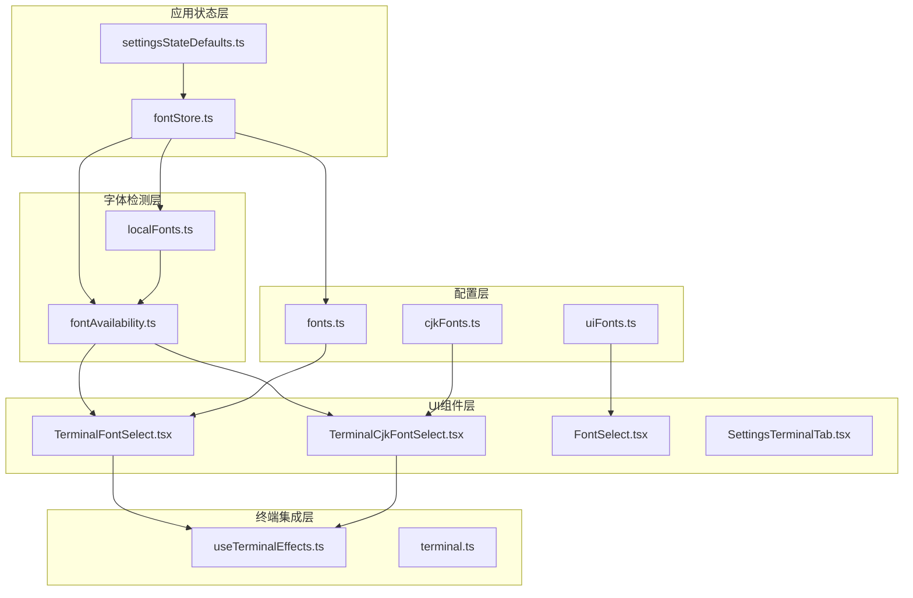
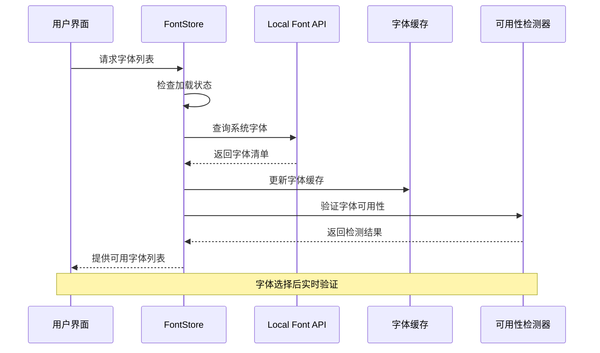
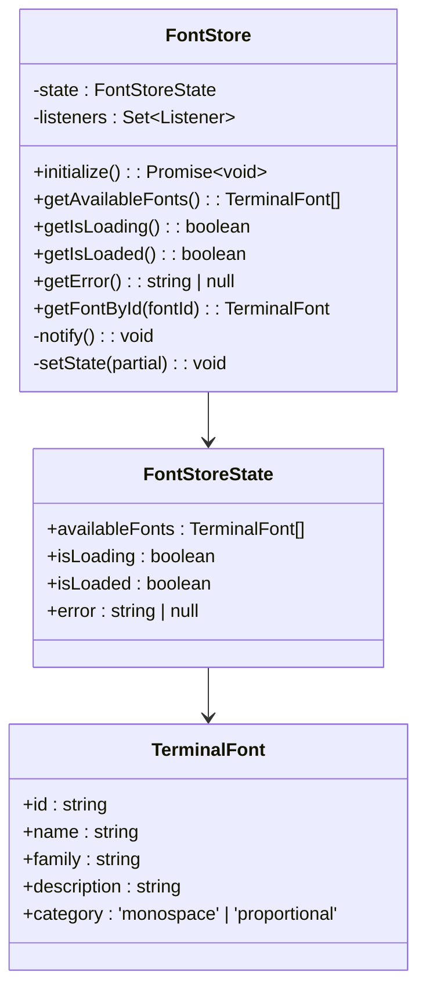
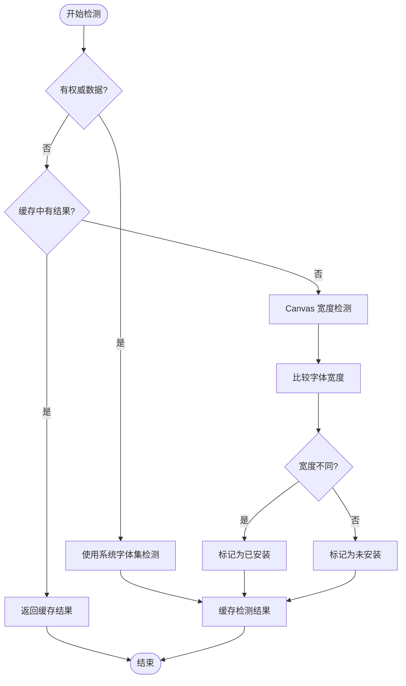
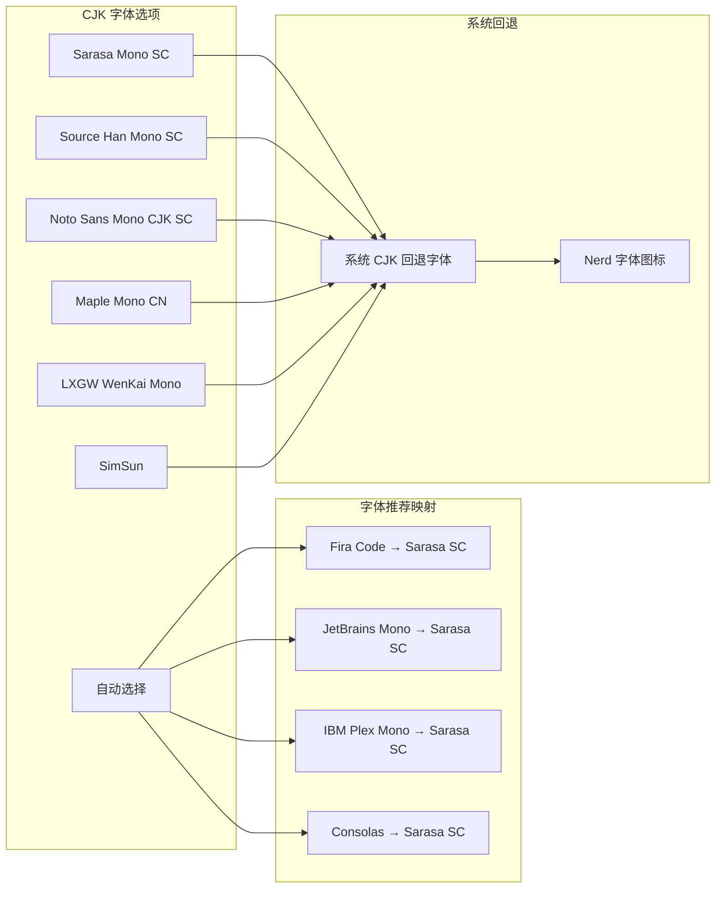
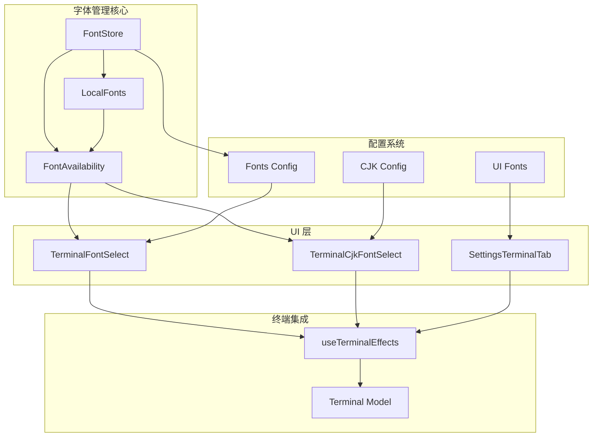

# 终端字体管理

<cite>
**本文档引用的文件**
- [application/state/fontStore.ts](file://application/state/fontStore.ts)
- [lib/localFonts.ts](file://lib/localFonts.ts)
- [lib/fontAvailability.ts](file://lib/fontAvailability.ts)
- [infrastructure/config/fonts.ts](file://infrastructure/config/fonts.ts)
- [infrastructure/config/cjkFonts.ts](file://infrastructure/config/cjkFonts.ts)
- [components/settings/TerminalFontSelect.tsx](file://components/settings/TerminalFontSelect.tsx)
- [components/settings/TerminalCjkFontSelect.tsx](file://components/settings/TerminalCjkFontSelect.tsx)
- [components/settings/FontSelect.tsx](file://components/settings/FontSelect.tsx)
- [components/settings/tabs/SettingsTerminalTab.tsx](file://components/settings/tabs/SettingsTerminalTab.tsx)
- [components/terminal/useTerminalEffects.ts](file://components/terminal/useTerminalEffects.ts)
- [domain/models/terminal.ts](file://domain/models/terminal.ts)
- [application/state/settingsStateDefaults.ts](file://application/state/settingsStateDefaults.ts)
- [infrastructure/config/uiFonts.ts](file://infrastructure/config/uiFonts.ts)
</cite>

## 目录
1. [简介](#简介)
2. [项目结构](#项目结构)
3. [核心组件](#核心组件)
4. [架构概览](#架构概览)
5. [详细组件分析](#详细组件分析)
6. [依赖关系分析](#依赖关系分析)
7. [性能考虑](#性能考虑)
8. [故障排除指南](#故障排除指南)
9. [结论](#结论)

## 简介

终端字体管理系统是 Netcatty 应用程序中的一个关键组件，负责管理终端界面中使用的字体选择、加载和渲染。该系统提供了完整的字体发现机制，支持本地字体访问 API，以及智能的字体可用性检测功能。

系统的核心目标是为用户提供流畅的字体选择体验，确保所选字体在不同操作系统上都能正确显示，并且能够处理 CJK（中日韩）字符的特殊需求。通过多层次的字体检测和缓存机制，系统能够在保证性能的同时提供准确的字体可用性信息。

## 项目结构

终端字体管理系统的文件组织遵循清晰的分层架构：

**图表来源**
- [application/state/fontStore.ts:1-161](file://application/state/fontStore.ts#L1-L161)
- [lib/localFonts.ts:1-190](file://lib/localFonts.ts#L1-L190)
- [lib/fontAvailability.ts:1-163](file://lib/fontAvailability.ts#L1-L163)

**章节来源**
- [application/state/fontStore.ts:1-161](file://application/state/fontStore.ts#L1-L161)
- [lib/localFonts.ts:1-190](file://lib/localFonts.ts#L1-L190)
- [lib/fontAvailability.ts:1-163](file://lib/fontAvailability.ts#L1-L163)

## 核心组件

### 字体存储管理器 (FontStore)

FontStore 是整个字体管理系统的核心，采用单例模式设计，使用 React 的 useSyncExternalStore 实现状态管理。它负责：

- **全局字体状态管理**：维护可用字体列表、加载状态和错误信息
- **异步字体初始化**：并行获取系统字体和默认字体配置
- **字体去重和合并**：避免重复字体条目，优先使用系统字体
- **监听器通知机制**：确保所有订阅组件能够及时更新

### 字体可用性检测器 (FontAvailability)

字体可用性检测器提供了多层字体检测机制：

- **权威数据源**：通过 Local Font Access API 获取系统字体清单
- **Canvas 回退检测**：在 API 不可用时使用文本宽度测量技术
- **缓存优化**：避免重复的字体检测操作
- **实时更新**：当系统字体发生变化时自动重新计算

### 字体配置管理

系统包含多个字体配置模块：

- **终端字体配置**：定义可用的编程字体集合
- **CJK 字体配置**：专门处理中日韩字符的字体映射
- **UI 字体配置**：管理应用程序界面字体设置
- **字体组合算法**：动态生成字体族堆栈以支持多语言显示

**章节来源**
- [application/state/fontStore.ts:19-115](file://application/state/fontStore.ts#L19-L115)
- [lib/fontAvailability.ts:29-81](file://lib/fontAvailability.ts#L29-L81)
- [infrastructure/config/fonts.ts:10-62](file://infrastructure/config/fonts.ts#L10-L62)

## 架构概览

终端字体管理系统采用分层架构设计，确保了良好的模块分离和可维护性：

**图表来源**
- [application/state/fontStore.ts:55-106](file://application/state/fontStore.ts#L55-L106)
- [lib/localFonts.ts:112-139](file://lib/localFonts.ts#L112-L139)
- [lib/fontAvailability.ts:131-155](file://lib/fontAvailability.ts#L131-L155)

系统的关键特性包括：

1. **异步初始化**：字体加载不会阻塞用户界面
2. **智能缓存**：避免重复的 API 调用和计算
3. **多层检测**：确保在各种环境下都能准确判断字体可用性
4. **实时更新**：当系统字体变化时自动刷新显示

## 详细组件分析

### 字体存储系统

FontStore 类实现了完整的字体状态管理逻辑：

**图表来源**
- [application/state/fontStore.ts:12-44](file://application/state/fontStore.ts#L12-L44)
- [infrastructure/config/fonts.ts:10-16](file://infrastructure/config/fonts.ts#L10-L16)

#### 初始化流程

字体初始化过程包含以下关键步骤：

1. **状态检查**：避免重复初始化
2. **并行查询**：同时获取系统字体和默认字体
3. **数据合并**：结合本地字体和内置字体
4. **去重处理**：确保字体列表的唯一性
5. **错误处理**：优雅降级到默认字体

**章节来源**
- [application/state/fontStore.ts:55-106](file://application/state/fontStore.ts#L55-L106)

### 字体检测机制

字体可用性检测系统提供了三种检测方式：

**图表来源**
- [lib/fontAvailability.ts:131-155](file://lib/fontAvailability.ts#L131-L155)
- [lib/fontAvailability.ts:119-129](file://lib/fontAvailability.ts#L119-L129)

#### 检测算法细节

检测算法采用了巧妙的宽度比较策略：

- **测试字符串**：使用包含大量小写字母的字符串进行测量
- **三基线比较**：与 serif、sans-serif、monospace 三个通用字体系列比较
- **差异判定**：只要与任意一个基线不同就认为字体已安装
- **平台适配**：处理特定平台（如 macOS）的字体解析差异

**章节来源**
- [lib/fontAvailability.ts:89-129](file://lib/fontAvailability.ts#L89-L129)

### CJK 字体支持

系统为 CJK 字符提供了专门的字体支持机制：

**图表来源**
- [infrastructure/config/cjkFonts.ts:40-72](file://infrastructure/config/cjkFonts.ts#L40-L72)
- [infrastructure/config/cjkFonts.ts:17-16](file://infrastructure/config/cjkFonts.ts#L17-L16)

#### 字体组合算法

字体组合算法确保了多语言环境下的正确显示：

1. **主字体优先**：始终将用户选择的字体放在首位
2. **拉丁字形回退**：使用专门的拉丁字体作为回退
3. **用户自定义 CJK**：允许用户指定特定的 CJK 字体
4. **系统回退链**：提供完整的系统字体回退机制
5. **图标字体支持**：包含 Nerd 字体图标集

**章节来源**
- [infrastructure/config/cjkFonts.ts:128-183](file://infrastructure/config/cjkFonts.ts#L128-L183)

### UI 组件实现

系统提供了多种字体选择组件以满足不同的使用场景：

#### 终端字体选择器

TerminalFontSelect 组件专门用于终端字体选择：

- **实时可用性过滤**：根据字体可用性动态过滤选项
- **本地字体检测**：支持 Local Font Access API 的实时检测
- **智能回退显示**：即使字体不可用也会显示当前选择
- **国际化支持**：支持多语言标签显示

#### CJK 字体选择器

TerminalCjkFontSelect 组件专为 CJK 字符设计：

- **自动检测机制**：支持 "自动" 选项的智能选择
- **遗留字体兼容**：兼容之前版本保存的字体设置
- **平台特定默认值**：根据不同操作系统提供合适的默认字体
- **严格字体限制**：只显示真正等宽的 CJK 字体

**章节来源**
- [components/settings/TerminalFontSelect.tsx:22-113](file://components/settings/TerminalFontSelect.tsx#L22-L113)
- [components/settings/TerminalCjkFontSelect.tsx:42-151](file://components/settings/TerminalCjkFontSelect.tsx#L42-L151)

## 依赖关系分析

字体管理系统与其他系统组件的依赖关系如下：

**图表来源**
- [application/state/fontStore.ts:1-10](file://application/state/fontStore.ts#L1-L10)
- [lib/localFonts.ts:1-5](file://lib/localFonts.ts#L1-L5)
- [lib/fontAvailability.ts:1-22](file://lib/fontAvailability.ts#L1-L22)

### 关键依赖点

1. **字体配置依赖**：所有字体选择组件都依赖于字体配置模块
2. **检测器依赖**：UI 组件依赖字体可用性检测器进行实时验证
3. **终端集成依赖**：最终的字体应用依赖于终端效果钩子
4. **配置继承**：设置状态默认值依赖于字体配置进行迁移

**章节来源**
- [application/state/settingsStateDefaults.ts:37-44](file://application/state/settingsStateDefaults.ts#L37-L44)
- [components/terminal/useTerminalEffects.ts:362-389](file://components/terminal/useTerminalEffects.ts#L362-L389)

## 性能考虑

字体管理系统在设计时充分考虑了性能优化：

### 缓存策略

- **字体清单缓存**：Local Font Access API 的结果会被缓存
- **检测结果缓存**：字体可用性检测结果会缓存以避免重复计算
- **Promise 去重**：并发调用会被去重处理，避免重复的 API 调用

### 异步处理

- **并行初始化**：系统字体和默认字体的获取是并行执行的
- **懒加载机制**：字体列表只在首次需要时才进行初始化
- **增量更新**：字体可用性变化时只更新受影响的部分

### 内存管理

- **弱引用监听器**：避免内存泄漏的监听器管理
- **条件加载**：只有在需要时才加载额外的字体资源
- **清理机制**：提供字体可用性缓存清理功能

## 故障排除指南

### 常见问题及解决方案

#### 字体不显示问题

**症状**：选择的字体在终端中不显示或显示异常

**可能原因**：
1. Local Font Access API 权限未授予
2. 字体文件损坏或不完整
3. 字体名称与实际安装名称不匹配

**解决步骤**：
1. 检查浏览器权限设置
2. 验证字体文件完整性
3. 使用字体 ID 而非字体名称进行选择

#### 字体选择器为空问题

**症状**：字体选择下拉框中没有任何选项

**可能原因**：
1. 浏览器不支持 Local Font Access API
2. 系统字体访问被拒绝
3. 字体检测缓存失效

**解决方法**：
1. 更新到支持 Local Font Access API 的浏览器版本
2. 重新授权字体访问权限
3. 清除字体可用性缓存

#### CJK 字符显示问题

**症状**：中文、日文或韩文字符显示异常

**解决步骤**：
1. 选择专门的 CJK 等宽字体
2. 检查字体组合设置
3. 验证系统 CJK 字体支持

**章节来源**
- [lib/fontAvailability.ts:157-162](file://lib/fontAvailability.ts#L157-L162)
- [lib/localFonts.ts:106-110](file://lib/localFonts.ts#L106-L110)

## 结论

终端字体管理系统展现了现代前端应用在字体管理方面的最佳实践。通过多层检测机制、智能缓存策略和优雅的降级处理，系统能够在各种环境下为用户提供一致的字体选择体验。

系统的主要优势包括：

1. **跨平台兼容性**：支持多种操作系统和浏览器环境
2. **性能优化**：通过缓存和异步处理确保响应速度
3. **用户体验**：提供直观的字体选择界面和实时反馈
4. **国际化支持**：专门针对 CJK 字符的字体处理机制
5. **可扩展性**：模块化设计便于功能扩展和维护

该系统为开发者提供了一个完整的字体管理解决方案，可以作为类似应用的参考实现。