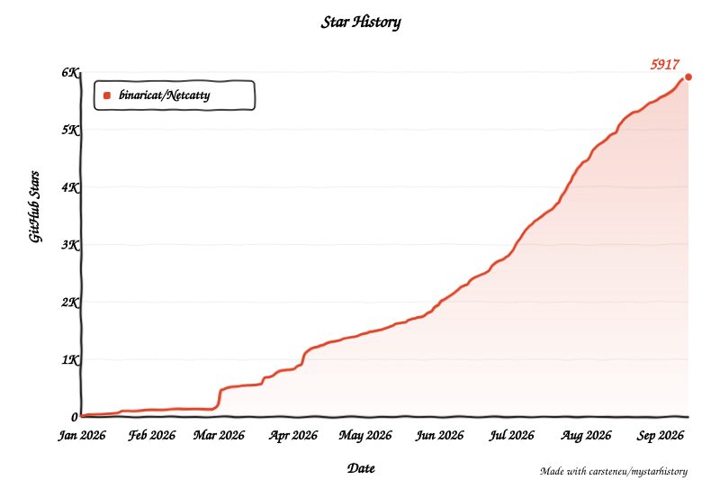

<p align="center">
  
</p>

<h1 align="center">Netcatty</h1>

<p align="center">
  <strong>🔥 AI 驅動的 SSH 用戶端、SFTP 瀏覽器與終端機管理工具 🚀</strong><br/>
  <a href="https://netcatty.app"><strong>netcatty.app</strong></a>
</p>

<p align="center">
  以 Electron、React 與 xterm.js 打造，介面精緻、功能完整的 SSH 工作區。<br/>
  🔥 內建 AI Agent · 分割終端 · Vault 檢視 · SFTP 工作流 · 自訂主題 —— 全部整合在一起。
</p>

<p align="center">
  <a href="https://github.com/binaricat/Netcatty/releases/latest"></a>
  &nbsp;
  <a href="#"></a>
  &nbsp;
  <a href="LICENSE"></a>
</p>

<p align="center">
  <a href="https://github.com/binaricat/Netcatty/releases/latest">
    
  </a>
</p>

<p align="center">
  <a href="https://ko-fi.com/binaricat">
    
  </a>
</p>

<p align="center">
  <a href="./README.md">English</a> · <a href="./README.zh-CN.md">简体中文</a> · <a href="./README.zh-TW.md">繁體中文</a> · <a href="./README.ja-JP.md">日本語</a>
</p>

---


---

<a name="catty-agent"></a>
# 🔥 Catty Agent —— 你的 IT 維運 AI 夥伴

> 🚀 **用 AI 加速你每天的 IT 維運工作。** Catty Agent 是內建的 AI 助理，它了解你的伺服器、會執行指令，並且透過自然對話完成複雜的多主機作業。

### 🔥 Catty Agent 能做什麼？

- 🚀 **用自然語言管理伺服器** —— 直接說出需求，不必再背指令
- 🔥 **即時伺服器診斷** —— 透過對話檢查狀態、查看日誌、監控資源
- 🚀 **多主機協同作業** —— 同時在多台伺服器上協調任務
- 🔥 **智慧的上下文感知** —— 理解你的伺服器環境，給出對症下藥的回應
- 🚀 **一句話完成複雜操作** —— 建立叢集、部署服務，交代一聲就好

### 🎬 AI 實戰示範

#### 🔥 單一主機 —— 智慧伺服器診斷

請 Catty Agent 檢查伺服器健康狀況，它會自動執行合適的指令、分析輸出，並在幾秒內給你一份清楚的總結。


#### 🚀 多主機 —— 建立 Docker Swarm 叢集

看 Catty Agent 在一次對話裡，跨兩台伺服器編排出一個 Docker Swarm 叢集。初始化、權杖交換、節點加入都由它處理 —— 你只要說出你想要的結果。


---

# 目錄 <!-- omit in toc -->

- [🔥 Catty Agent —— AI 夥伴](#catty-agent)
- [Netcatty 是什麼](#netcatty-是什麼)
- [為什麼選 Netcatty](#為什麼選-netcatty)
- [功能特色](#功能特色)
- [介面截圖](#介面截圖)
  - [主視窗](#主視窗)
  - [Vault 檢視](#vault-檢視)
  - [分割終端](#分割終端)
- [支援的發行版](#支援的發行版)
- [快速開始](#快速開始)
- [建置與打包](#建置與打包)
- [技術堆疊](#技術堆疊)
- [參與貢獻](#參與貢獻)
- [貢獻者](#貢獻者)
- [Star 紀錄](#star-紀錄)
- [授權條款](#授權條款)

---

<a name="netcatty-是什麼"></a>
# Netcatty 是什麼

**Netcatty** 是一套現代化的 SSH 用戶端與終端機管理工具，支援 macOS、Windows 與 Linux，專為需要有效率管理多台遠端伺服器的開發者、系統管理員與 DevOps 工程師而設計。

- **Netcatty 是** PuTTY、Termius、SecureCRT 與 macOS Terminal.app 在 SSH 連線上的替代方案
- **Netcatty 是** 一套功能完整的 SFTP 用戶端，具備雙窗格檔案瀏覽器
- **Netcatty 是** 一個終端機工作區，支援分割窗格、分頁與工作階段管理
- **Netcatty 支援** SSH、本機終端、Telnet、Mosh 與序列埠（Serial）連線（視環境而定）
- **Netcatty 不是** Shell 的替代品 —— 它是透過 SSH／Telnet／Mosh 或本機／序列埠工作階段連上 Shell

---

<a name="為什麼選-netcatty"></a>
# 為什麼選 Netcatty

如果你經常同時照顧一整批伺服器，Netcatty 是為了速度與順暢而設計的：

- **以工作區為核心** —— 分割窗格 + 分頁 + 工作階段還原，適合長時間掛著的工作流程
- **Vault 整理** —— 網格／清單／樹狀檢視，搭配快速搜尋與順手的拖曳操作
- **認真做的 SFTP** —— 內建編輯器 + 拖放 + 流暢的檔案操作

---

<a name="功能特色"></a>
# 功能特色

### 🗂️ Vault
- **多種檢視** —— 網格／清單／樹狀
- **快速搜尋** —— 迅速找到主機與群組

### 🖥️ 終端機工作區
- **分割窗格** —— 水平與垂直分割，方便多工
- **工作階段管理** —— 多條連線並排處理
- **內嵌圖片** —— 直接顯示遠端程式輸出的 Kitty 圖形、SIXEL 與 iTerm 內嵌圖片

### 📁 SFTP + 內建編輯器
- **檔案工作流** —— 拖放上傳／下載
- **就地編輯** —— 內建編輯器，快速修改檔案

### 🎨 個人化
- **自訂主題** —— 依你的喜好調整外觀
- **關鍵字高亮** —— 自訂終端輸出的高亮規則

---

<a name="介面截圖"></a>
# 介面截圖

<a name="主視窗"></a>
## 主視窗

主視窗是為了長時間的 SSH 工作流程而設計：工作階段、導覽與常用工具都集中在同一個地方。


<a name="vault-檢視"></a>
## Vault 檢視

用最適合當下情境的方式整理與瀏覽主機：網格看全局、清單快速掃視、樹狀理層級。


<a name="分割終端"></a>
## 分割終端

分割窗格讓你同時盯著多台伺服器或多個服務（部署 + 日誌 + 監控指標），不用一直切視窗。


---

<a name="支援的發行版"></a>
# 支援的發行版

Netcatty 會自動辨識已連線主機的作業系統，並顯示對應圖示：

<p align="center">
  
  
  
  
  
  
  
  
  
  
  
  
  
</p>

<a name="快速開始"></a>
# 快速開始

### 下載

到 [GitHub Releases](https://github.com/binaricat/Netcatty/releases/latest) 下載適合你平台的最新版本。

| 作業系統 | 支援情況 |
| :--- | :--- |
| **macOS** | Universal (x64 / arm64) |
| **Windows** | x64 / arm64 |
| **Linux** | x64 / arm64 |

也可以到 [GitHub Releases](https://github.com/binaricat/Netcatty/releases) 瀏覽所有版本。

### 程式碼簽章與隱私

Netcatty 正在申請 SignPath Foundation 的開源專案計畫。通過之後，適用的 Windows
發行檔會採用 **Free code signing provided by SignPath.io, certificate by SignPath Foundation**。
詳情請見[程式碼簽章政策](CODE_SIGNING_POLICY.md)與[隱私權政策](PRIVACY.md)。在申請與介接完成前，
Windows 發行檔可能仍未簽章。

> **Windows 免安裝版的資料存放：** 先結束 Netcatty，然後在 `Netcatty.exe`（zip 版）或免安裝版啟動檔旁邊建立一個名為 `data` 的資料夾。下次啟動時，Netcatty 就會把設定檔存在那裡。已儲存的密碼與私密金鑰仍受建立它們的那個 Windows 使用者帳戶保護，所以把資料夾搬到另一台電腦或另一個 Windows 帳戶後，這些資訊必須重新輸入。

> **在 Windows 用 Netcatty 開啟資料夾：** 安裝版會在檔案總管的資料夾右鍵選單與資料夾空白處右鍵選單加入 **Open in Netcatty**，點了就會在該資料夾開啟本機終端。Windows 11 要先選 **顯示其他選項**。這個選單可以在 **設定 → 系統 → Windows 檔案總管** 隨時關閉或重新開啟。ZIP 版與免安裝版預設不會加入這個選單。

> **macOS 使用者請注意：** 目前的發行版本應該都已完成程式碼簽章與公證。如果 Gatekeeper 仍然跳出警告，請確認你下載的是 GitHub Releases 上最新的官方建置版本。

### Nix / NixOS

Netcatty 提供了一個 flake，替 Nix 與 NixOS 使用者包裝官方的 Linux AppImage 發行版：

```bash
nix run github:binaricat/Netcatty
```

若要以宣告式方式安裝，把 Netcatty flake 加為 input，並在你的 NixOS 或 Home Manager 套件清單中使用 `inputs.netcatty.packages.${pkgs.system}.default`。

### 事前需求
- Node.js 18+ 與 npm
- macOS、Windows 10+ 或 Linux

### 開發

```bash
# 複製儲存庫
git clone https://github.com/binaricat/Netcatty.git
cd Netcatty

# 安裝相依套件
npm install

# 啟動開發模式（Vite + Electron）
npm run dev
```

---

<a name="建置與打包"></a>
# 建置與打包

```bash
# 建置正式版
npm run build

# 為目前平台打包
npm run pack

# 為特定平台打包
npm run pack:mac     # macOS (DMG + ZIP)
npm run pack:win     # Windows (NSIS 安裝程式)
npm run pack:linux   # Linux (AppImage + DEB + RPM)
```

---

<a name="技術堆疊"></a>
# 技術堆疊

| 分類 | 技術 |
|------|------|
| 框架 | Electron 40 |
| 前端 | React 19, TypeScript |
| 建置工具 | Vite 7 |
| 終端機 | xterm.js 5 |
| 樣式 | Tailwind CSS 4 |
| SSH/SFTP | ssh2, ssh2-sftp-client |
| PTY | node-pty |
| 圖示 | Lucide React |

---

<a name="參與貢獻"></a>
# 參與貢獻

歡迎參與貢獻！請隨時送出 Pull Request。

1. Fork 本儲存庫
2. 建立你的功能分支（`git checkout -b feature/amazing-feature`）
3. 提交你的變更（`git commit -m 'Add some amazing feature'`）
4. 推送到該分支（`git push origin feature/amazing-feature`）
5. 開一個 Pull Request

架構概觀與程式碼慣例請見 [AGENTS.md](AGENTS.md)。

---

<a name="貢獻者"></a>
# 貢獻者

感謝每一位參與貢獻的人！

<a href="https://github.com/binaricat/Netcatty/graphs/contributors">
  
</a>

---

<a name="授權條款"></a>
# 授權條款

本專案採用 **GPL-3.0 授權** —— 詳情請見 [LICENSE](LICENSE) 檔案。

---

<a name="star-紀錄"></a>
# Star 紀錄

<a href="https://www.star-history.com/#binaricat/Netcatty&Date">
 <picture>
   <source media="(prefers-color-scheme: dark)" srcset="docs/assets/star-history/star-history-dark.svg" />
   <source media="(prefers-color-scheme: light)" srcset="docs/assets/star-history/star-history-light.svg" />
   
 </picture>
</a>

---

<p align="center">
  由 <a href="https://ko-fi.com/binaricat">binaricat</a> 用 ❤️ 打造
</p>
