# StrictMode + 消灭巨型订阅者

## 已拍板的目标

- 整棵 React 树开 `StrictMode`（主窗 + settings/tray/terminal-popup 所有 `root.render`）。
- Terminal boot：cleanup **立即 abort/close**，Cancel 对齐 Disconnect 的 epoch 失效；非 plugin 协议也吃 `AbortSignal`。
- 你列的 8 条重渲命门 **全部修完**，且验收标准是：**没有任何高频状态再让 App 根组件 / AppView 五域整壳无谓重渲**。
- 做完后循环 Bugbot → fix → 再 review，直到 clean；再跑遗漏清单，有漏继续清。

## 核心架构（延续 #2790，上推到根）

```mermaid
flowchart TB
  subgraph publishers [PublisherIslands_no_children_props]
    SettingsPub[SettingsPublisher]
    VaultPub[VaultPublisher]
    SessionPub[SessionPublisher]
    DialogsPub[DialogsPublisher]
  end

  subgraph stores [ExternalStores_useSyncExternalStore]
    Notes[notesStore]
    Accent[appearanceChromeStore]
    ConnLogs[connectionLogsStore]
    SettingsChrome[settingsChromeStore]
    VaultSnap[vaultSnapshotStore]
    SessionSnap[sessionSnapshotStore]
    AISessions[aiSessionsStore]
    AIConfig[AIConfigContext_slow]
  end

  subgraph shell [AppShell_memo_no_root_hooks]
    ChromeHost[ChromeHost]
    VaultHost[VaultHost]
    TerminalHost[TerminalHost]
    DialogsHost[DialogsHost]
  end

  SettingsPub --> Accent
  SettingsPub --> SettingsChrome
  VaultPub --> Notes
  VaultPub --> ConnLogs
  VaultPub --> VaultSnap
  SessionPub --> SessionSnap
  SessionPub --> AISessions

  ChromeHost --> Accent
  ChromeHost --> SettingsChrome
  VaultHost --> VaultSnap
  VaultHost --> Notes
  VaultHost --> ConnLogs
  TerminalHost --> SessionSnap
  TerminalHost --> AISessions
  TerminalHost --> AIConfig
```

**关键不变量**

- Publisher 组件只跑现有 hooks（`useVaultState` / `useSessionState` / `useSettingsState` 等），通过 `useLayoutEffect`/`publish*` 写入 store，**不向子树传业务 props**。
- 壳与岛屿只 `useSyncExternalStore`（或慢变 Context）按需订阅；**禁止**再在同一组件里 `useVaultState` + 渲染整棵 `AppView`。
- Domain bag（[`appViewDomains.ts`](application/app/appViewDomains.ts)）要么删掉，要么缩成「岛屿内部的局部 props 包」——**不得**再由 App 根因 notes/accent/logs/settings/sessions 而重建。

复用现有模式：[`notesStore.ts`](application/state/notesStore.ts)、[`appearanceChromeStore.ts`](application/state/appearanceChromeStore.ts)。

---

## Phase 0 — 分支与设计落盘

- 从最新 `main` 开分支：`perf/strictmode-mega-subscriber-elimination`。
- 写 spec：`docs/superpowers/specs/2026-08-07-strictmode-mega-subscriber-design.md`（验收清单 = 下文 Definition of Done）。
- 写 plan 副本到 `docs/superpowers/plans/`（便于多 agent 对齐）。

---

## Phase 1 — StrictMode 硬化（可与 Phase 2 并行）

| 位点 | 改法 |
|------|------|
| [`index.tsx`](index.tsx) | 所有 `root.render` 外包 `<React.StrictMode>`（主窗 / settings / tray / terminal-popup） |
| [`Terminal.tsx`](components/Terminal.tsx) `handleCancelConnect` | 对齐 `handleDisconnect`：`invalidateBootEpochForClose()` + `isBootActiveRef.current = false`，再 `cleanupSession` |
| [`useTerminalEffects.ts`](components/terminal/useTerminalEffects.ts) | cleanup：**先** `AbortController.abort()` + `closeSession({ bootEpoch })`，再异步 capture/teardown；`boot()` 全协议传 `signal`（SSH/local/mosh/telnet/et/serial，plugin 已有） |
| starters / bridge | 扩展 `AbortSignal` 到 dial 全程；与现有 `registerPendingBootAbort` / `abortPendingBoot` 对齐 |
| [`App.tsx`](App.tsx) `pendingNewWindowSession` | payload identity latch：先 clear / consume，再 `createSessionFromCloneSource` |
| External MCP startup | module single-flight `syncExternalMcpStartupStateOnce`；cleanup 不双飞 IPC |
| [`useUpdateCheck`](application/app/) / [`useAppStartupEffects`](application/app/useAppStartupEffects.ts) | cleanup 重置错误 latch；update toast 按 version latch |
| splash `rendererReady` | module once |
| PF auto-start | 保留 ref latch，补 StrictMode 双 effect 测试；失败可清 latch 重试 |

**测试**：Cancel+epoch 源码/行为断言；boot cleanup 在 capture 前 close；MCP single-flight；pendingNewWindow 不双建；update toast 不双弹。

---

## Phase 2 — 高频状态迁出 domain（清 2/3/4/5）

并行可拆 3 个 agent：

1. **notes**：从 [`appVaultDomain`](App.tsx) / VaultView props 移除；Vault/NotesManager 只 `useNotesStore()`。更新 [`VaultView.memo.test.tsx`](components/VaultView.memo.test.tsx)：notes churn 不再打 VaultView/AppView。
2. **accent**：从 `appChromeDomain` / `AppHostTreeLayer` props 移除；[`AppView.tsx`](application/app/AppView.tsx) 的 `appThemeStyle` 改为叶子/局部订阅 `appearanceChromeStore`（Vault 容器、HostTree chrome 各自订）。accent drag → **零 AppView 五域重建**。
3. **connectionLogs**：新建 `connectionLogsStore`（同 notesStore 形状）；`useVaultState` publish；logs section 才订阅；从 vault domain deps 删除。日志追加 → **不打 AppView**。
4. **settings 整袋**：新建 `settingsChromeStore`（或扩展 appearance store），只发布 TopTabs/HostTree/chrome 真正需要的字段；`appChromeDomain` **禁止**再塞整袋 `settings`。任意无关 settings 字段变化不重建 chrome 壳。

同步改：[`AppFollowTerminalTheme.test.ts`](application/app/AppFollowTerminalTheme.test.ts)、[`AppMounts.test.ts`](application/app/AppMounts.test.ts)、[`appViewDomains.test.ts`](application/app/appViewDomains.test.ts)。

---

## Phase 3 — 物理拆掉 App 巨型订阅者（清 1，彻底）

目标：[`App.tsx`](App.tsx) / 当前内层 `App` **不再**同时持有 vault+session+settings 的 React state 并渲染壳。

落点（新文件，建议）：

- `application/app/publishers/SettingsPublisher.tsx`
- `application/app/publishers/VaultPublisher.tsx`
- `application/app/publishers/SessionPublisher.tsx`
- `application/app/publishers/DialogsPublisher.tsx`（或并入壳内低频岛）
- `application/state/vaultSnapshotStore.ts`（hosts/keys/snippets/… 慢变快变按字段 notify；至少支持 selector）
- `application/state/sessionSnapshotStore.ts`（sessions/workspaces；presentation 已有 store 的继续复用）
- `application/app/AppShell.tsx` — memo，无巨型 hook
- `ChromeHost` / `VaultHost` / `TerminalHost` / `DialogsHost` — 各自订阅

迁移策略：先 Publisher 旁路 publish + 岛屿读 store，再删 App 根上的 domain `useMemo` 与 props 漏斗；保持 IPC/handler 注册不丢。

验收：**在 Profiler 或契约测试中**，改 notes / accent / connectionLogs / 无关 settings / 单 session 流式更新时，`AppShell` 与无关 Host **不** re-render。

---

## Phase 4 — Context 拆分（清 6/7/8）

1. **AI**：`aiSessionsStore`（`useSyncExternalStore` + per-scope selector）+ 慢变 `AIConfigContext`（providers/permissions）。[`TerminalLayerSupport.tsx`](components/terminalLayer/TerminalLayerSupport.tsx) 的 `AIStateProvider` 不再整包 `sessions` 塞 Context。`AIChatPanelsHost` 只订本 scope。
2. **SFTP**：拆 `SftpHostsContext` 与 `SftpPaneCallbacksContext`（left/right 可再拆）；保留已有 `SftpDragContext` / `activeTabStore`。
3. **Toast**：`ToastActionsContext`（稳定 `showToast`/`dismissToast`，`useMemo`）与 `ToastStateContext`（仅 Toaster 订 `toasts`）。全局 `toast.*` 不变。

---

## Phase 5 — 开 StrictMode 压测与契约测试门禁

- Phase 1 修完后正式合入 StrictMode（若分 PR，最后一 PR 打开；本任务按用户要求一次做完则同分支打开）。
- 新增/加强：
  - domain/store memo 契约测试（notes/accent/logs/settings/AI scope）
  - architecture 测试：AppShell/App 源码禁止 `useVaultState`+`useSessionState`+`useSettingsState` 同组件渲染
  - StrictMode 幂等：pendingNewWindow、MCP startup、update check/toast、Cancel boot
- 跑：`npm test` 相关子集 + 关键文件全量；`npm run lint`。

---

## Phase 6 — Bugbot 死循环到 clean

按 [`review-bugbot`](~/.cursor/skills-cursor/review-bugbot/SKILL.md)：

1. `Diff: branch changes` 跑 Bugbot
2. 修全部有效 finding
3. 再跑，直到 **无有效问题**
4. 若 diff 算不出，改 `natural language` 重试一次

穿插：security-review 仅在用户另要时；本任务默认 Bugbot 循环。

---

## Phase 7 — 遗漏审计（你要求的「不可以有遗漏」）

对照清单逐项打勾，漏则继续改：

- [ ] App 根无巨型三 hook 同渲染
- [ ] notes / accent / connectionLogs / 整袋 settings 不进跨壳 domain
- [ ] AI 流式不导致 sibling panel / 无关 Host 重渲
- [ ] Sftp hosts 变不拖 callbacks 消费者（反之亦然）
- [ ] Toast 更新不重渲整 App 树订阅者
- [ ] StrictMode 已开；Cancel/boot abort/双挂载幂等测过
- [ ] 旧 memo 测试与 #2790 契约仍绿，并补「父壳也不炸」断言
- [ ] 无「父已炸、子假装没事」残留（以壳是否订阅为准，不以子 areEqual 为准）

---

## 多 agent 并行切分

| Agent | 范围 |
|-------|------|
| A | StrictMode + Terminal abort/Cancel + App 幂等 effects |
| B | notes + connectionLogs store 迁出 + Vault 订阅改造 |
| C | accent + settingsChromeStore + AppView/HostTree 叶子订 |
| D | App Publisher/Shell 物理拆分 + vault/session snapshot stores |
| E | AI sessions store + Sftp Context 拆 + Toast 拆 |
| 主控 | 合入冲突、契约测试、遗漏审计、Bugbot 循环 |

---

## 风险与约束

- Electron 长连接：StrictMode 双挂载依赖 Phase 1；未完成前不要只开 StrictMode。
- 不引入新状态库依赖；沿用自研 `useSyncExternalStore` store。
- 不借机大改产品行为；handler/IPC 语义保持。
- ASCII 源码；中文仅注释/文案已有处。
- 提交仅在你明确要求时再做。